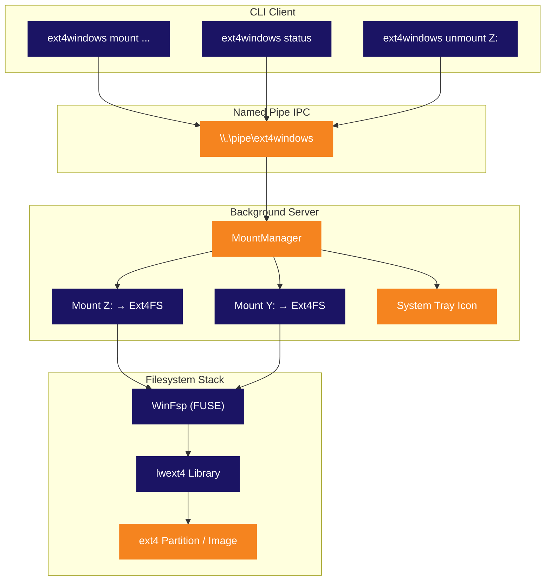

<p align="center">
  
</p>

<p align="center">
  <strong>Montez des partitions ext4 Linux comme des lettres de lecteur Windows natives.</strong><br>
  <sub>Pas de VM. Pas de WSL. Pas de prise de tete. Branchez et parcourez.</sub>
</p>

<p align="center">
  
  
  
  
  
  
</p>

<p align="center">
  
  
  
  
</p>

<p align="center">
  <sub>🌍 <a href="README.md">English</a> · <a href="README.pt-BR.md">Português</a> · <a href="README.es.md">Español</a> · <a href="README.de.md">Deutsch</a> · <strong>Français</strong> · <a href="README.zh.md">中文</a> · <a href="README.ja.md">日本語</a> · <a href="README.ru.md">Русский</a></sub>
</p>

<p align="center">
  <a href="#démarrage-rapide"><kbd> <br> Démarrage rapide <br> </kbd></a>&nbsp;&nbsp;
  <a href="#installation"><kbd> <br> Installation <br> </kbd></a>&nbsp;&nbsp;
  <a href="#compiler-depuis-les-sources"><kbd> <br> Compiler depuis les sources <br> </kbd></a>&nbsp;&nbsp;
  <a href="https://github.com/Mateuscruz19/Ext4Windows/issues"><kbd> <br> Signaler un bug <br> </kbd></a>
</p>

<br>

<p align="center">
  
</p>

<br>

## Le problème

Le dual-boot Linux et Windows est courant. Accéder à vos fichiers Linux depuis Windows ? **Galère.**

Windows n'a **aucun** support natif de l'ext4. Votre partition Linux est invisible. Vos fichiers sont prisonniers derrière un système de fichiers que Windows refuse de lire.

Les solutions existantes ont toutes de sérieux inconvénients :

| Outil | Problème |
|:-----|:--------|
| **Ext2Fsd** | Abandonné depuis 2017. Pilote en mode noyau = risque de BSOD. Pas de support des extents ext4. |
| **Paragon ExtFS** | Logiciel payant (40 $+). Code source fermé. |
| **DiskInternals Reader** | Lecture seule. Pas de drive letter — les fichiers sont accessibles via une interface personnalisée peu pratique. |
| **WSL `wsl --mount`** | Fonctionne dans une VM Hyper-V. Nécessite les droits admin. Pas de véritable drive letter. Fichiers accessibles via le chemin `\\wsl$\`. |

<br>

## La solution

**Ext4Windows** monte les systèmes de fichiers ext4 comme de **véritables drive letters Windows**. Vos fichiers Linux apparaissent dans l'Explorateur, comme n'importe quelle clé USB. Ouvrir, modifier, copier, supprimer — tout fonctionne nativement.

```
C:\> ext4windows mount D:\linux.img
  OK Mounted D:\linux.img on Z: (read-only)
```

Vos fichiers ext4 sont maintenant sur **Z:** — parcourez-les dans l'Explorateur, ouvrez-les dans n'importe quelle application, glissez-déposez. C'est fait.

<br>

<p align="center">
  
</p>

<br>

## Fonctionnalités

<table>
<tr>
<td width="50%" valign="top">

### Noyau
- Mount d'images ext4 (`.img`) comme drive letters
- Mount de partitions ext4 brutes depuis des disques physiques
- Support complet en **lecture** — fichiers, répertoires, liens symboliques
- Support complet en **écriture** — créer, modifier, supprimer, copier, renommer
- Mounts simultanés multiples (Z:, Y:, X:, ...)

</td>
<td width="50%" valign="top">

### Architecture
- Serveur en arrière-plan avec **icône dans la zone de notification**
- Client CLI pour les scripts et l'automatisation
- Named Pipe IPC pour une communication client-serveur rapide
- Démarrage automatique du serveur au premier mount
- Nettoyage propre lors de l'éjection/unmount

</td>
</tr>
<tr>
<td width="50%" valign="top">

### Ergonomie
- **Détection automatique** des partitions ext4 avec `scan`
- Sélection automatique d'une drive letter libre (de Z: à D:)
- Clic droit sur l'icône de la zone de notification pour unmount ou quitter
- Mode legacy one-shot pour un usage simple
- Journalisation de débogage pour le diagnostic

</td>
<td width="50%" valign="top">

### Technique
- Pilote en espace utilisateur — pas de module noyau, pas de risque de BSOD
- Noms de périphérique ext4 par instance (multi-mount sûr)
- mutex global pour la sécurité des threads lwext4
- Modèle open-per-operation (pas de fuite de handles)
- Détection des mounts fantômes et nettoyage automatique

</td>
</tr>
</table>

<br>

<p align="center">
  
</p>

<br>

## Comparaison

Comment Ext4Windows se compare-t-il aux alternatives ?

| Fonctionnalité | Ext4Windows | Ext2Fsd | DiskInternals | Paragon | WSL `--mount` |
|:--------|:-----------:|:-------:|:-------------:|:-------:|:-------------:|
| **Véritable drive letter** | ✅ | ✅ | ❌ | ✅ | ❌ |
| **Support en lecture** | ✅ | ✅ | ✅ | ✅ | ✅ |
| **Support en écriture** | ✅ | ⚠️ Partiel | ❌ | ✅ | ✅ |
| **Extents ext4** | ✅ | ❌ | ✅ | ✅ | ✅ |
| **Pas de redémarrage** | ✅ | ❌ | ✅ | ✅ | ✅ |
| **Pas de droits admin** | ✅ | ❌ | ✅ | ❌ | ❌ |
| **Interface zone de notification** | ✅ | ❌ | ✅ | ✅ | ❌ |
| **Open source** | ✅ | ✅ | ❌ | ❌ | ❌ |
| **Activement maintenu** | ✅ | ❌ (2017) | ❌ | ✅ | ✅ |
| **Espace utilisateur (pas de BSOD)** | ✅ | ❌ | ✅ | ❌ | ✅ |
| **Gratuit** | ✅ | ✅ | ✅ | ❌ (40 $+) | ✅ |

<br>

<p align="center">
  
</p>

<br>

## Démarrage rapide

### Monter une image ext4

```bash
# Mount en lecture seule (par défaut) — sélection automatique de la drive letter
ext4windows mount path\to\image.img

# Mount sur une drive letter spécifique
ext4windows mount path\to\image.img X:

# Mount avec support en écriture
ext4windows mount path\to\image.img --rw

# Mount avec écriture sur une lettre spécifique
ext4windows mount path\to\image.img X: --rw
```

### Gérer les mounts

```bash
# Vérifier ce qui est monté
ext4windows status

# Unmount d'un lecteur
ext4windows unmount Z:

# Scanner les partitions ext4 sur les disques physiques (nécessite admin)
ext4windows scan

# Arrêter le serveur en arrière-plan
ext4windows quit
```

### Mode legacy

Pour un usage ponctuel rapide sans l'architecture client-serveur :

```bash
# Mount et blocage jusqu'à Ctrl+C
ext4windows path\to\image.img Z:

# Mount en lecture-écriture en mode legacy
ext4windows path\to\image.img Z: --rw
```

<br>

<p align="center">
  
</p>

<br>

## Architecture

Ext4Windows utilise une **architecture client-serveur**. La première commande `mount` démarre automatiquement un serveur en arrière-plan, qui gère tous les mounts et affiche une icône dans la zone de notification.



### Comment fonctionne la lecture d'un fichier

Lorsque vous ouvrez un fichier dans l'Explorateur sur le lecteur monté, voici ce qui se passe en coulisses :

```
L'Explorateur ouvre Z:\docs\readme.txt
  → Le noyau Windows envoie IRP_MJ_READ au pilote WinFsp
    → WinFsp appelle notre callback OnRead dans Ext4FileSystem
      → Nous verrouillons le mutex global ext4
        → lwext4 ouvre le fichier : ext4_fopen("/mnt_Z/docs/readme.txt", "rb")
        → lwext4 lit les octets demandés : ext4_fread()
        → lwext4 ferme le fichier : ext4_fclose()
      → Nous déverrouillons le mutex
    → Les données remontent via WinFsp jusqu'au noyau
  → L'Explorateur affiche le contenu du fichier
```

### Zone de notification

Le serveur crée une **icône dans la zone de notification** (system tray) en utilisant l'API Win32 pure :

- **Survolez** l'icône pour voir le nombre de mounts
- **Clic droit** pour voir les mounts actifs, unmount des lecteurs ou quitter
- L'icône utilise le logo Ext4Windows (intégré dans l'exe via un fichier de ressources)
- Si un lecteur est éjecté via l'Explorateur, le serveur le détecte et nettoie automatiquement le mount fantôme

<br>

<p align="center">
  
</p>

<br>

## Installation

### Prérequis

- **Windows 10 ou 11** (64 bits)
- **[WinFsp](https://winfsp.dev/rel/)** — téléchargez et installez la dernière version

### Téléchargement

> Les versions compilées arrivent bientôt. Pour l'instant, [compilez depuis les sources](#compiler-depuis-les-sources).

### Vérifier que ça fonctionne

```bash
# Créer une image ext4 de test avec WSL (si disponible)
wsl -e bash -c "dd if=/dev/zero of=/tmp/test.img bs=1M count=64 && mkfs.ext4 /tmp/test.img"
cp \\wsl$\Ubuntu\tmp\test.img .

# La monter
ext4windows mount test.img
```

<br>

<p align="center">
  
</p>

<br>

## Compiler depuis les sources

### Prérequis

| Outil | Version | Utilité |
|:-----|:--------|:--------|
| **Windows** | 10 ou 11 | Système d'exploitation cible |
| **Visual Studio 2022** | Build Tools ou IDE complet | Compilateur C++ (MSVC) |
| **CMake** | 3.16+ | Système de build |
| **Git** | N'importe quelle version | Cloner avec les sous-modules |
| **[WinFsp](https://winfsp.dev/rel/)** | Dernière version | Framework FUSE + SDK |

> **Note :** Vous avez besoin de la charge de travail **"Développement Desktop en C++"** dans Visual Studio.

### Cloner

```bash
git clone --recursive https://github.com/Mateuscruz19/Ext4Windows.git
cd Ext4Windows
```

> Le flag `--recursive` est important — il récupère le sous-module **lwext4** depuis `external/lwext4/`.

### Compiler

Ouvrez une **Invite de commandes développeur pour VS 2022** (ou exécutez `VsDevCmd.bat`), puis :

```bash
mkdir build
cd build
cmake ..
cmake --build .
```

L'exécutable sera dans `build\ext4windows.exe`.

### Script de compilation rapide

Si vous avez les Build Tools de VS installés, exécutez simplement :

```bash
build.bat
```

Ce script configure automatiquement l'environnement VS et lance la compilation.

### Structure du projet

```
Ext4Windows/
├── assets/                    # Logo et ressources visuelles
│   ├── ext4windows.ico        # Icône de l'application (multi-taille)
│   ├── logo_icon.png          # Logo sans texte
│   └── logo_with_text.png     # Logo avec texte "Ext4Windows"
├── cmake/                     # Modules CMake (FindWinFsp)
├── external/
│   └── lwext4/                # Sous-module lwext4 (implémentation ext4)
├── src/
│   ├── main.cpp               # Point d'entrée et routage des arguments
│   ├── ext4_filesystem.cpp/hpp  # Callbacks du système de fichiers WinFsp
│   ├── server.cpp/hpp         # Serveur en arrière-plan + MountManager
│   ├── client.cpp/hpp         # Client CLI
│   ├── tray_icon.cpp/hpp      # Icône de la zone de notification (Win32)
│   ├── pipe_protocol.hpp      # Protocole Named Pipe IPC
│   ├── blockdev_file.cpp/hpp  # Périphérique bloc depuis un fichier .img
│   ├── blockdev_partition.cpp/hpp  # Périphérique bloc depuis une partition brute
│   ├── partition_scanner.cpp/hpp   # Détection automatique des partitions ext4
│   ├── debug_log.hpp          # Utilitaires de journalisation de débogage
│   └── ext4windows.rc         # Fichier de ressources Windows (icône)
├── CMakeLists.txt             # Configuration de build
├── build.bat                  # Script de compilation rapide
└── LICENSE                    # GPL-2.0
```

<br>

<p align="center">
  
</p>

<br>

## Stack technique

<table>
<tr>
<td align="center" width="150">
  
  <br><sub>Langage principal</sub>
</td>
<td align="center" width="150">
  
  <br><sub>Système de fichiers virtuel</sub>
</td>
<td align="center" width="150">
  
  <br><sub>Implémentation ext4</sub>
</td>
<td align="center" width="150">
  
  <br><sub>Zone de notification, pipes, processus</sub>
</td>
<td align="center" width="150">
  
  <br><sub>Système de build</sub>
</td>
</tr>
</table>

| Bibliothèque | Rôle | Lien |
|:--------|:-----|:-----|
| **WinFsp** | Framework FUSE pour Windows. Crée des systèmes de fichiers virtuels qui apparaissent comme de vrais lecteurs. Gère toute la communication avec le noyau — nous implémentons simplement les callbacks (OnRead, OnWrite, OnCreate, etc.) | [winfsp.dev](https://winfsp.dev) |
| **lwext4** | Bibliothèque ext4 portable en C pur. Lit et écrit le format ext4 sur disque : superbloc, groupes de blocs, inodes, extents, entrées de répertoire. Utilisée comme sous-module. | [github.com/gkostka/lwext4](https://github.com/gkostka/lwext4) |
| **Win32 API** | API natives Windows pour l'icône de la zone de notification (`Shell_NotifyIconW`), les named pipes (`CreateNamedPipeW`), la gestion des processus (`CreateProcessW`) et la détection des drive letters (`GetLogicalDrives`). | [learn.microsoft.com](https://learn.microsoft.com/en-us/windows/win32/) |

<br>

<p align="center">
  
</p>

<br>

## Sécurité et fiabilité mémoire

Ext4Windows est audité avec quatre outils d'analyse indépendants. Tous les tests sont exécutés à chaque version.

<table>
<tr>
<th>Outil</th>
<th>Ce qu'il vérifie</th>
<th>Résultat</th>
</tr>
<tr>
<td><strong>AddressSanitizer (ASan)</strong><br><sub><code>/fsanitize=address</code></sub></td>
<td>Débordements de tampon, use-after-free, corruption de pile, corruption de tas — détectés à l'exécution lors d'un cycle complet mount → lecture → écriture → unmount → quit</td>
<td><strong>PASS — 0 erreur</strong></td>
</tr>
<tr>
<td><strong>MSVC Code Analysis</strong><br><sub><code>/analyze</code></sub></td>
<td>Analyse statique pour les déréférencements de pointeurs nuls, débordements de tampon, mémoire non initialisée, débordements d'entiers, anti-patterns de sécurité (règles C6000–C28000)</td>
<td><strong>PASS — 0 vulnérabilité</strong><br><sub>7 avertissements informatifs (vérifications de handles nuls — tous protégés à l'exécution)</sub></td>
</tr>
<tr>
<td><strong>CppCheck 2.20</strong><br><sub><code>--enable=all --inconclusive</code></sub></td>
<td>Analyseur statique indépendant (183 vérificateurs) : débordements de tampon, déréférencements nuls, fuites de ressources, variables non initialisées, problèmes de portabilité</td>
<td><strong>PASS — 0 bug, 0 vulnérabilité</strong><br><sub>Suggestions de style uniquement (const correctness, variables inutilisées)</sub></td>
</tr>
<tr>
<td><strong>CRT Debug Heap</strong><br><sub><code>_CrtDumpMemoryLeaks</code></sub></td>
<td>Fuites mémoire — suit chaque <code>new</code>/<code>malloc</code> et signale tout ce qui n'est pas libéré à la sortie. Testé : création/destruction de blockdev, cycle complet ext4 mount/lecture/unmount</td>
<td><strong>PASS — 0 fuite</strong></td>
</tr>
</table>

### Mesures de durcissement de la sécurité

| Protection | Description |
|:-----------|:------------|
| **ACL du Named Pipe** | Pipe restreint à l'utilisateur créateur via SDDL `D:(A;;GA;;;CU)` — les autres utilisateurs du système ne peuvent pas envoyer de commandes |
| **Prévention du path traversal** | Tous les chemins sont validés contre les séquences `..` et les octets nuls avant traitement |
| **Validation des drive letters** | Seules les lettres `A-Z` sont acceptées comme drive letters dans les commandes MOUNT/MOUNT_PARTITION |
| **Protection contre les débordements d'entiers** | Les tailles de lecture/écriture de blocs sont vérifiées avant multiplication pour éviter un débordement DWORD |
| **Chemin explicite du processus** | `CreateProcessW` utilise un chemin d'exe explicite (pas de détournement via la recherche PATH) |
| **Copies de chaînes bornées** | Tous les `wcscpy` remplacés par `wcsncpy` + terminateur nul pour éviter les débordements de tampon |
| **Pilote en espace utilisateur** | Pas de module noyau — un crash ne peut pas causer de BSOD ni corrompre la mémoire système |

<br>

<p align="center">
  
</p>

<br>

## Feuille de route

### Terminé

- [x] Mount d'images ext4 comme drive letters Windows
- [x] Support complet en lecture — fichiers, répertoires, liens symboliques
- [x] Support complet en écriture — créer, modifier, supprimer, copier, renommer
- [x] Détection automatique des partitions ext4 sur les disques physiques
- [x] Architecture client-serveur avec daemon en arrière-plan
- [x] Icône dans la zone de notification avec menu contextuel
- [x] Mounts simultanés multiples
- [x] Protocole Named Pipe IPC
- [x] Démarrage automatique du serveur au premier mount
- [x] Détection des mounts fantômes (nettoyage automatique à l'éjection)
- [x] Journalisation de débogage (console + fichier)
- [x] Icône d'application personnalisée

### En cours

(rien actuellement)

### Récemment terminé

- [x] Mount de partitions brutes via client-serveur (commandes MOUNT_PARTITION + SCAN)
- [x] Mappage des permissions Linux (bits de mode ext4 → attributs Windows et ACL)
- [x] Démarrage automatique à la connexion (clé Run du Registre Windows)
- [x] Horodatages des fichiers (ext4 crtime/atime/mtime/ctime → création/accès/écriture/modification Windows)
- [x] Support de la journalisation (ext4_recover + ext4_journal_start/stop)
- [x] Optimisation des performances (cache de blocs de 512 Ko + mise en cache des métadonnées WinFsp)
- [x] Support des fichiers volumineux (>4 Go avec calculs de blocs 64 bits)
- [x] Installateur (Inno Setup) et version portable (.zip)

### Prévu

- [x] Panneau de paramètres (en terminal, persisté dans un fichier de configuration)

<br>

<p align="center">
  
</p>

<br>

<details>
<summary><h2>FAQ</h2></summary>

### Est-ce sûr ? Cela peut-il corrompre ma partition Linux ?

Ext4Windows fonctionne entièrement en **espace utilisateur** (grâce à WinFsp), il ne peut donc pas provoquer de Blue Screen of Death (BSOD). Le code est audité avec AddressSanitizer, l'analyse statique MSVC et la détection de fuites CRT — voir [Sécurité et fiabilité mémoire](#sécurité-et-fiabilité-mémoire). Par mesure de sécurité, le mode de mount par défaut est en **lecture seule**. Le mode écriture (`--rw`) inclut le support de la journalisation ext4 pour la récupération après crash. Conservez toujours des sauvegardes.

### Ai-je besoin de privilèges administrateur ?

**Non** — pour monter des fichiers image (`.img`), aucun droit admin n'est nécessaire. La commande `scan` (qui analyse les disques physiques) nécessite les droits admin car elle doit accéder aux périphériques de disque bruts (`\\.\PhysicalDrive0`, etc.). Le programme demandera automatiquement l'élévation UAC si nécessaire.

### Quelles fonctionnalités ext4 sont prises en charge ?

lwext4 prend en charge les fonctionnalités principales d'ext4 : extents, adressage de blocs 64 bits, indexation de répertoires (htree), checksums de métadonnées et journalisation (récupération + transactions d'écriture). Fonctionnalités **non** prises en charge : inline data, chiffrement et verity.

### Puis-je monter des partitions ext2 ou ext3 ?

Oui ! ext4 est rétrocompatible avec ext2 et ext3. lwext4 peut lire les trois formats.

### Est-ce que ça fonctionne avec les partitions Linux en dual-boot ?

Oui, c'est le cas d'utilisation principal. Utilisez `ext4windows scan` pour trouver et monter votre partition Linux. **Important :** ne montez pas votre partition racine Linux avec `--rw` si Linux pourrait l'utiliser (par exemple, si vous utilisez WSL). Cela peut provoquer une corruption de données.

### Pourquoi ne pas simplement utiliser WSL `wsl --mount` ?

WSL monte les partitions dans une machine virtuelle Hyper-V. Les fichiers ne sont accessibles que via le chemin réseau `\\wsl$\`, pas comme une véritable drive letter. Cela nécessite les droits admin, a un surcoût plus élevé et ne s'intègre pas à l'Explorateur Windows de la même manière qu'un vrai lecteur.

### Puis-je utiliser ceci avec des clés USB formatées en ext4 ?

Oui ! Utilisez `ext4windows scan` pour détecter la partition ext4 sur la clé USB, puis montez-la.

### L'icône de la zone de notification a disparu. Que s'est-il passé ?

Le serveur a peut-être planté ou a été arrêté. Exécutez `ext4windows status` — si le serveur ne tourne pas, la prochaine commande `mount` le redémarrera automatiquement.

### Comment activer la journalisation de débogage ?

Ajoutez `--debug` à n'importe quelle commande :

```bash
ext4windows mount image.img --debug
```

Pour le serveur, les journaux de débogage sont écrits dans `%TEMP%\ext4windows_server.log`.

</details>

<br>

<details>
<summary><h2>Dépannage</h2></summary>

### "Error: could not start server"

Le processus serveur n'a pas pu démarrer. Causes possibles :
- Une autre instance est déjà en cours d'exécution — essayez `ext4windows quit` d'abord
- L'antivirus bloque le processus — ajoutez une exception pour `ext4windows.exe`
- WinFsp n'est pas installé — téléchargez-le depuis [winfsp.dev/rel](https://winfsp.dev/rel/)

### "Error: server did not start in time"

Le serveur a démarré mais le named pipe n'a pas été créé dans les 3 secondes. Cela peut arriver si :
- La DLL WinFsp (`winfsp-x64.dll`) n'est pas trouvée — assurez-vous qu'elle est dans le même répertoire que `ext4windows.exe` ou que WinFsp est installé à l'échelle du système
- Le système est sous forte charge — réessayez

### "Mount failed (status=0xC00000XX)"

WinFsp a renvoyé une erreur lors du mount. Codes courants :
- `0xC0000034` — Drive letter déjà utilisée par un autre programme
- `0xC0000022` — Permission refusée (essayez de lancer en tant qu'administrateur)
- `0xC000000F` — Fichier non trouvé (vérifiez le chemin de l'image)

### "Error: server is busy, try again"

Le serveur traite une commande à la fois. Si un autre client communique actuellement, vous obtiendrez cette erreur. Réessayez simplement.

### Les fichiers affichent 0 octet ou ne peuvent pas être ouverts

Cela signifie généralement que l'image ext4 est corrompue ou utilise des fonctionnalités non prises en charge. Essayez :
1. Vérifiez l'image avec `fsck.ext4` sous Linux/WSL
2. Activez la journalisation de débogage (`--debug`) pour voir l'erreur spécifique
3. Essayez de monter en lecture seule d'abord (supprimez `--rw`)

### Le lecteur a disparu de l'Explorateur

Si vous éjectez le lecteur depuis l'Explorateur (clic droit → Éjecter), le serveur le détecte et nettoie automatiquement. Exécutez `ext4windows status` pour confirmer. Pour remonter, relancez la commande mount.

</details>

<br>

<p align="center">
  
</p>

<br>

## Contribuer

Les contributions sont les bienvenues ! Ce projet est activement développé et il y a beaucoup à faire.

1. **Forkez** le dépôt
2. **Créez** une branche de fonctionnalité (`git checkout -b feature/truc-genial`)
3. **Commitez** vos modifications
4. **Poussez** vers la branche
5. **Ouvrez** une Pull Request

Consultez la [Feuille de route](#feuille-de-route) pour des idées sur quoi travailler. N'hésitez pas à ouvrir une issue pour discuter avant de commencer des modifications importantes.

<br>

## Licence

Ce projet est sous licence **GNU General Public License v2.0** — voir le fichier [LICENSE](LICENSE) pour les détails.

<br>

<p align="center">
  
</p>

<p align="center">
  <sub>Construit avec WinFsp et lwext4. Logo inspiré de l'empreinte du pingouin Linux et de la fenêtre Windows.</sub>
</p>
