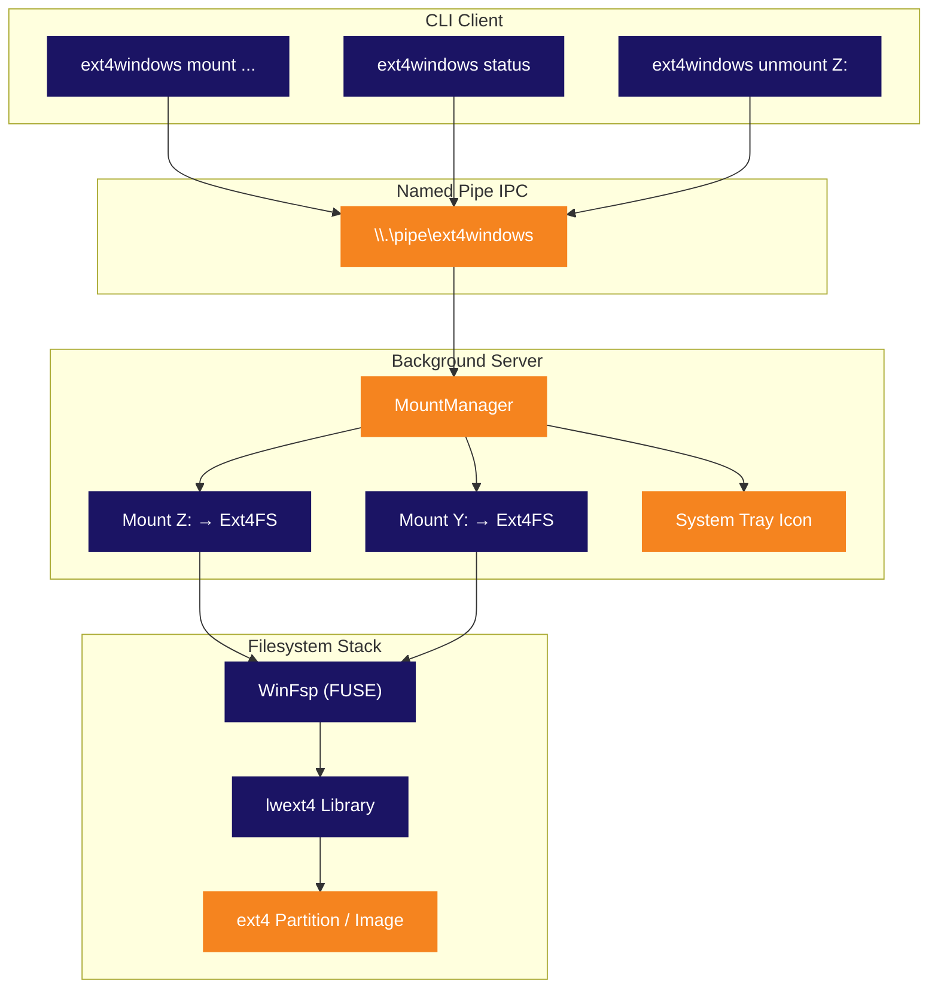

<p align="center">
  
</p>

<p align="center">
  <strong>Mount Linux ext4 partitions as native Windows drive letters.</strong><br>
  <sub>No VM. No WSL. No hassle. Just plug and browse.</sub>
</p>

<p align="center">
  
  
  
  
  
  
</p>

<p align="center">
  <sub>🌍 English · Português · Español · Deutsch · Français · 中文 · 日本語 · Русский</sub>
</p>

<p align="center">
  <a href="#-quick-start"><kbd> <br> Quick Start <br> </kbd></a>&nbsp;&nbsp;
  <a href="#-installation"><kbd> <br> Installation <br> </kbd></a>&nbsp;&nbsp;
  <a href="#-building-from-source"><kbd> <br> Build from Source <br> </kbd></a>&nbsp;&nbsp;
  <a href="https://github.com/mateucruz/Ext4Windows/issues"><kbd> <br> Report Bug <br> </kbd></a>
</p>

<br>

<p align="center">
  
</p>

<br>

## The Problem

Dual-booting Linux and Windows is common. Accessing your Linux files from Windows? **Painful.**

Windows has **zero** native ext4 support. Your Linux partition is invisible. Your files are trapped behind a filesystem Windows refuses to read.

The existing solutions all have serious drawbacks:

| Tool | Problem |
|:-----|:--------|
| **Ext2Fsd** | Abandoned since 2017. Kernel-mode driver = BSOD risk. No ext4 extent support. |
| **Paragon ExtFS** | Paid software ($40+). Closed source. |
| **DiskInternals Reader** | Read-only. No drive letter — files are accessed through a clunky custom UI. |
| **WSL `wsl --mount`** | Runs inside a Hyper-V VM. Requires admin. Not a real drive letter. Files accessed through `\\wsl$\` path. |

<br>

## The Solution

**Ext4Windows** mounts ext4 filesystems as **real Windows drive letters**. Your Linux files show up in Explorer, just like any USB drive. Open, edit, copy, delete — everything works natively.

```
C:\> ext4windows mount D:\linux.img
  OK Mounted D:\linux.img on Z: (read-only)
```

Your ext4 files are now on **Z:** — browse them in Explorer, open them in any app, drag & drop. Done.

<br>

<p align="center">
  
</p>

<br>

## Features

<table>
<tr>
<td width="50%" valign="top">

### Core
- Mount ext4 images (`.img`) as drive letters
- Mount raw ext4 partitions from physical disks
- Full **read support** — files, directories, symlinks
- Full **write support** — create, edit, delete, copy, rename
- Multiple simultaneous mounts (Z:, Y:, X:, ...)

</td>
<td width="50%" valign="top">

### Architecture
- Background server with **system tray icon**
- CLI client for scripting and automation
- Named Pipe IPC for fast client-server communication
- Auto-start server on first mount command
- Graceful cleanup on eject/unmount

</td>
</tr>
<tr>
<td width="50%" valign="top">

### Usability
- **Auto-detect** ext4 partitions with `scan`
- Auto-select free drive letter (Z: down to D:)
- Right-click tray icon to unmount or quit
- Legacy one-shot mode for simple usage
- Debug logging for troubleshooting

</td>
<td width="50%" valign="top">

### Technical
- Userspace driver — no kernel module, no BSOD risk
- Per-instance ext4 device names (multi-mount safe)
- Global mutex for lwext4 thread safety
- Open-per-operation pattern (no handle leaks)
- Ghost mount detection and auto-cleanup

</td>
</tr>
</table>

<br>

<p align="center">
  
</p>

<br>

## Comparison

How does Ext4Windows stack up against the alternatives?

| Feature | Ext4Windows | Ext2Fsd | DiskInternals | Paragon | WSL `--mount` |
|:--------|:-----------:|:-------:|:-------------:|:-------:|:-------------:|
| **Real drive letter** | ✅ | ✅ | ❌ | ✅ | ❌ |
| **Read support** | ✅ | ✅ | ✅ | ✅ | ✅ |
| **Write support** | ✅ | ⚠️ Partial | ❌ | ✅ | ✅ |
| **ext4 extents** | ✅ | ❌ | ✅ | ✅ | ✅ |
| **No reboot needed** | ✅ | ❌ | ✅ | ✅ | ✅ |
| **No admin required** | ✅ | ❌ | ✅ | ❌ | ❌ |
| **System tray GUI** | ✅ | ❌ | ✅ | ✅ | ❌ |
| **Open source** | ✅ | ✅ | ❌ | ❌ | ❌ |
| **Actively maintained** | ✅ | ❌ (2017) | ❌ | ✅ | ✅ |
| **Userspace (no BSOD)** | ✅ | ❌ | ✅ | ❌ | ✅ |
| **Free** | ✅ | ✅ | ✅ | ❌ ($40+) | ✅ |

<br>

<p align="center">
  
</p>

<br>

## Quick Start

### Mount an ext4 image

```bash
# Mount read-only (default) — auto-selects drive letter
ext4windows mount path\to\image.img

# Mount on a specific drive letter
ext4windows mount path\to\image.img X:

# Mount with write support
ext4windows mount path\to\image.img --rw

# Mount with write support on specific letter
ext4windows mount path\to\image.img X: --rw
```

### Manage mounts

```bash
# Check what's mounted
ext4windows status

# Unmount a drive
ext4windows unmount Z:

# Scan for ext4 partitions on physical disks (requires admin)
ext4windows scan

# Shut down the background server
ext4windows quit
```

### Legacy mode

For quick one-off usage without the client-server architecture:

```bash
# Mount and block until Ctrl+C
ext4windows path\to\image.img Z:

# Mount read-write in legacy mode
ext4windows path\to\image.img Z: --rw
```

<br>

<p align="center">
  
</p>

<br>

## Architecture

Ext4Windows uses a **client-server architecture**. The first `mount` command auto-starts a background server, which manages all mounts and shows a system tray icon.



### How a file read works

When you open a file in Explorer on the mounted drive, here's what happens under the hood:

```
Explorer opens Z:\docs\readme.txt
  → Windows kernel sends IRP_MJ_READ to WinFsp driver
    → WinFsp calls our OnRead callback in Ext4FileSystem
      → We lock the global ext4 mutex
        → lwext4 opens the file: ext4_fopen("/mnt_Z/docs/readme.txt", "rb")
        → lwext4 reads the requested bytes: ext4_fread()
        → lwext4 closes the file: ext4_fclose()
      → We unlock the mutex
    → Data flows back through WinFsp to the kernel
  → Explorer displays the file content
```

### System Tray

The server creates a **system tray icon** (notification area) using pure Win32 API:

- **Hover** the icon to see mount count
- **Right-click** to see active mounts, unmount drives, or quit
- The icon uses the Ext4Windows logo (embedded in the exe via resource file)
- If a drive is ejected via Explorer, the server detects it and auto-cleans the ghost mount

<br>

<p align="center">
  
</p>

<br>

## Installation

### Prerequisites

- **Windows 10 or 11** (64-bit)
- **[WinFsp](https://winfsp.dev/rel/)** — download and install the latest release

### Download

> Releases coming soon. For now, [build from source](#-building-from-source).

### Verify it works

```bash
# Create a test ext4 image using WSL (if available)
wsl -e bash -c "dd if=/dev/zero of=/tmp/test.img bs=1M count=64 && mkfs.ext4 /tmp/test.img"
cp \\wsl$\Ubuntu\tmp\test.img .

# Mount it
ext4windows mount test.img
```

<br>

<p align="center">
  
</p>

<br>

## Building from Source

### Prerequisites

| Tool | Version | Purpose |
|:-----|:--------|:--------|
| **Windows** | 10 or 11 | Target OS |
| **Visual Studio 2022** | Build Tools or full IDE | C++ compiler (MSVC) |
| **CMake** | 3.16+ | Build system |
| **Git** | Any | Clone with submodules |
| **[WinFsp](https://winfsp.dev/rel/)** | Latest | FUSE framework + SDK |

> **Note:** You need the **"Desktop development with C++"** workload in Visual Studio.

### Clone

```bash
git clone --recursive https://github.com/mateucruz/Ext4Windows.git
cd Ext4Windows
```

> The `--recursive` flag is important — it pulls the **lwext4** submodule from `external/lwext4/`.

### Build

Open a **Developer Command Prompt for VS 2022** (or run `VsDevCmd.bat`), then:

```bash
mkdir build
cd build
cmake ..
cmake --build .
```

The executable will be at `build\ext4windows.exe`.

### Quick build script

If you have VS Build Tools installed, just run:

```bash
build.bat
```

This script automatically sets up the VS environment and builds.

### Project structure

```
Ext4Windows/
├── assets/                    # Logo and visual assets
│   ├── ext4windows.ico        # Application icon (multi-size)
│   ├── logo_icon.png          # Logo without text
│   └── logo_with_text.png     # Logo with "Ext4Windows" text
├── cmake/                     # CMake modules (FindWinFsp)
├── external/
│   └── lwext4/                # lwext4 submodule (ext4 implementation)
├── src/
│   ├── main.cpp               # Entry point and argument routing
│   ├── ext4_filesystem.cpp/hpp  # WinFsp filesystem callbacks
│   ├── server.cpp/hpp         # Background server + MountManager
│   ├── client.cpp/hpp         # CLI client
│   ├── tray_icon.cpp/hpp      # System tray icon (Win32)
│   ├── pipe_protocol.hpp      # Named Pipe IPC protocol
│   ├── blockdev_file.cpp/hpp  # Block device from .img file
│   ├── blockdev_partition.cpp/hpp  # Block device from raw partition
│   ├── partition_scanner.cpp/hpp   # Ext4 partition auto-detection
│   ├── debug_log.hpp          # Debug logging utilities
│   └── ext4windows.rc         # Windows resource file (icon)
├── CMakeLists.txt             # Build configuration
├── build.bat                  # Quick build script
└── LICENSE                    # GPL-2.0
```

<br>

<p align="center">
  
</p>

<br>

## Tech Stack

<table>
<tr>
<td align="center" width="150">
  
  <br><sub>Core language</sub>
</td>
<td align="center" width="150">
  
  <br><sub>Virtual filesystem</sub>
</td>
<td align="center" width="150">
  
  <br><sub>ext4 implementation</sub>
</td>
<td align="center" width="150">
  
  <br><sub>Tray, pipes, processes</sub>
</td>
<td align="center" width="150">
  
  <br><sub>Build system</sub>
</td>
</tr>
</table>

| Library | Role | Link |
|:--------|:-----|:-----|
| **WinFsp** | Windows FUSE framework. Creates virtual filesystems that appear as real drives. Handles all kernel communication — we just implement callbacks (OnRead, OnWrite, OnCreate, etc.) | [winfsp.dev](https://winfsp.dev) |
| **lwext4** | Portable ext4 filesystem library in pure C. Reads and writes the ext4 on-disk format: superblock, block groups, inodes, extents, directory entries. We use it as a submodule. | [github.com/gkostka/lwext4](https://github.com/gkostka/lwext4) |
| **Win32 API** | Native Windows APIs for system tray icon (`Shell_NotifyIconW`), named pipes (`CreateNamedPipeW`), process management (`CreateProcessW`), and drive letter detection (`GetLogicalDrives`). | [learn.microsoft.com](https://learn.microsoft.com/en-us/windows/win32/) |

<br>

<p align="center">
  
</p>

<br>

## Roadmap

### Done

- [x] Mount ext4 image files as Windows drive letters
- [x] Full read support — files, directories, symlinks
- [x] Full write support — create, edit, delete, copy, rename
- [x] Auto-detect ext4 partitions on physical disks
- [x] Client-server architecture with background daemon
- [x] System tray icon with context menu
- [x] Multiple simultaneous mounts
- [x] Named Pipe IPC protocol
- [x] Auto-start server on first mount
- [x] Ghost mount detection (auto-cleanup on eject)
- [x] Debug logging (console + file)
- [x] Custom application icon

### In Progress

(nothing currently)

### Recently Completed

- [x] Mount raw partitions via client-server (MOUNT_PARTITION + SCAN commands)
- [x] Linux permission mapping (ext4 mode bits → Windows attributes & ACLs)
- [x] Auto-start on login (Windows Registry Run key)
- [x] File timestamps (ext4 crtime/atime/mtime/ctime → Windows creation/access/write/change)
- [x] Journaling support (ext4_recover + ext4_journal_start/stop)
- [x] Performance optimization (512KB block cache + WinFsp metadata caching)

### Planned

- [ ] Installer / portable release (.zip)
- [ ] Large file support (>4GB files on ext4)
- [ ] GUI settings panel

<br>

<p align="center">
  
</p>

<br>

<details>
<summary><h2>FAQ</h2></summary>

### Is this safe? Can it corrupt my Linux partition?

Ext4Windows runs entirely in **userspace** (thanks to WinFsp), so it cannot cause a Blue Screen of Death (BSOD). For safety, the default mount mode is **read-only**. Only use `--rw` if you understand the risks — lwext4 does not yet support journaling, so a crash during a write could leave the filesystem in an inconsistent state. Always keep backups.

### Do I need admin privileges?

**No** — for mounting image files (`.img`), no admin is needed. The `scan` command (which scans physical disks) does require admin because it needs to access raw disk devices (`\\.\PhysicalDrive0`, etc.). The program will automatically prompt for UAC elevation when needed.

### What ext4 features are supported?

lwext4 supports the core ext4 features: extents, 64-bit block addressing, directory indexing (htree), and metadata checksums. Features **not** yet supported: journaling replay, inline data, encryption, and verity.

### Can I mount ext2 or ext3 partitions?

Yes! ext4 is backwards-compatible with ext2 and ext3. lwext4 can read all three formats.

### Does it work with dual-boot Linux partitions?

Yes, that's the primary use case. Use `ext4windows scan` to find and mount your Linux partition. **Important:** do not mount your Linux root partition with `--rw` while Linux might be using it (e.g., if you're running WSL). This can cause data corruption.

### Why not just use WSL `wsl --mount`?

WSL mounts partitions inside a Hyper-V virtual machine. The files are accessible only through `\\wsl$\` network path, not as a real drive letter. It requires admin, has higher overhead, and doesn't integrate with Windows Explorer the same way a real drive does.

### Can I use this with USB drives formatted as ext4?

Yes! Use `ext4windows scan` to detect the ext4 partition on the USB drive, then mount it.

### The tray icon disappeared. What happened?

The server might have crashed or been killed. Run `ext4windows status` — if the server isn't running, the next `mount` command will auto-start it.

### How do I enable debug logging?

Add `--debug` to any command:

```bash
ext4windows mount image.img --debug
```

For the server, debug logs are written to `%TEMP%\ext4windows_server.log`.

</details>

<br>

<details>
<summary><h2>Troubleshooting</h2></summary>

### "Error: could not start server"

The server process failed to launch. Possible causes:
- Another instance is already running — try `ext4windows quit` first
- Antivirus is blocking the process — add an exception for `ext4windows.exe`
- WinFsp is not installed — download from [winfsp.dev/rel](https://winfsp.dev/rel/)

### "Error: server did not start in time"

The server started but the named pipe wasn't created within 3 seconds. This can happen if:
- WinFsp DLL (`winfsp-x64.dll`) is not found — make sure it's in the same directory as `ext4windows.exe` or WinFsp is installed system-wide
- The system is under heavy load — try again

### "Mount failed (status=0xC00000XX)"

WinFsp returned an error during mount. Common codes:
- `0xC0000034` — Drive letter already in use by another program
- `0xC0000022` — Permission denied (try running as admin)
- `0xC000000F` — File not found (check the image path)

### "Error: server is busy, try again"

The server handles one command at a time. If another client is currently communicating, you'll get this error. Just retry.

### Files show 0 bytes or can't be opened

This usually means the ext4 image is corrupted or uses unsupported features. Try:
1. Check the image with `fsck.ext4` in Linux/WSL
2. Enable debug logging (`--debug`) to see the specific error
3. Try mounting read-only first (remove `--rw`)

### Drive disappeared from Explorer

If you eject the drive from Explorer (right-click → Eject), the server detects this and cleans up automatically. Run `ext4windows status` to confirm. To re-mount, run the mount command again.

</details>

<br>

<p align="center">
  
</p>

<br>

## Contributing

Contributions are welcome! This project is actively developed and there's plenty to do.

1. **Fork** the repository
2. **Create** a feature branch (`git checkout -b feature/amazing-thing`)
3. **Commit** your changes
4. **Push** to the branch
5. **Open** a Pull Request

Check the [Roadmap](#roadmap) for ideas on what to work on. Feel free to open an issue for discussion before starting large changes.

<br>

## License

This project is licensed under the **GNU General Public License v2.0** — see the [LICENSE](LICENSE) file for details.

<br>

<p align="center">
  
</p>

<p align="center">
  <sub>Built with WinFsp and lwext4. Logo inspired by the Linux penguin footprint and Windows window.</sub>
</p>
