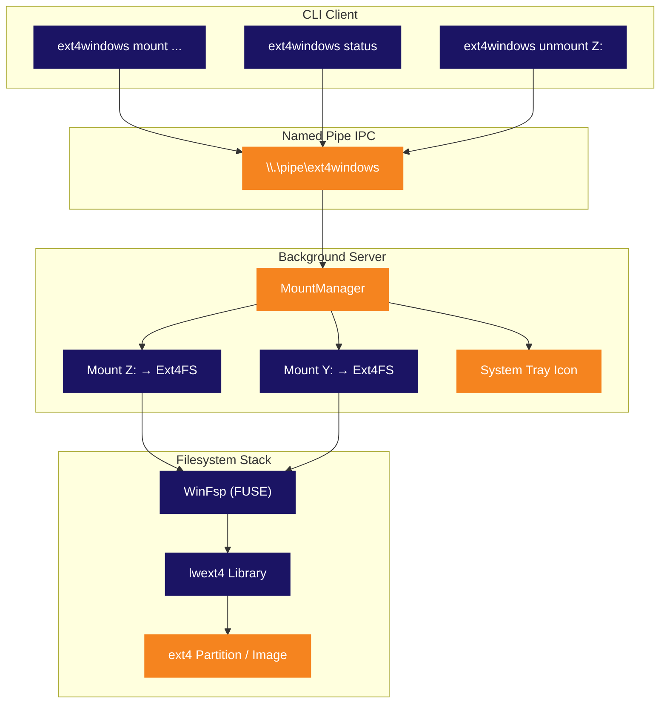

<p align="center">
  
</p>

<p align="center">
  <strong>Монтируйте разделы Linux ext4 как обычные буквы дисков Windows.</strong><br>
  <sub>Без VM. Без WSL. Без лишних сложностей. Подключите и просматривайте.</sub>
</p>

<p align="center">
  
  
  
  
  
  
</p>

<p align="center">
  
  
  
  
</p>

<p align="center">
  <sub>🌍 <a href="README.md">English</a> · <a href="README.pt-BR.md">Português</a> · <a href="README.es.md">Español</a> · <a href="README.de.md">Deutsch</a> · <a href="README.fr.md">Français</a> · <a href="README.zh.md">中文</a> · <a href="README.ja.md">日本語</a> · <b>Русский</b></sub>
</p>

<p align="center">
  <a href="#быстрый-старт"><kbd> <br> Быстрый старт <br> </kbd></a>&nbsp;&nbsp;
  <a href="#установка"><kbd> <br> Установка <br> </kbd></a>&nbsp;&nbsp;
  <a href="#сборка-из-исходников"><kbd> <br> Сборка из исходников <br> </kbd></a>&nbsp;&nbsp;
  <a href="https://github.com/Mateuscruz19/Ext4Windows/issues"><kbd> <br> Сообщить об ошибке <br> </kbd></a>
</p>

<br>

<p align="center">
  
</p>

<br>

## Проблема

Двойная загрузка Linux и Windows — обычное дело. Доступ к файлам Linux из Windows? **Мучение.**

Windows **не имеет** нативной поддержки ext4. Ваш раздел Linux невидим. Ваши файлы заблокированы за файловой системой, которую Windows отказывается читать.

У существующих решений есть серьёзные недостатки:

| Инструмент | Проблема |
|:-----|:--------|
| **Ext2Fsd** | Заброшен с 2017 года. Драйвер режима ядра = риск BSOD. Нет поддержки ext4 extent. |
| **Paragon ExtFS** | Платное ПО ($40+). Закрытый исходный код. |
| **DiskInternals Reader** | Только чтение. Нет буквы диска — файлы доступны через неудобный пользовательский интерфейс. |
| **WSL `wsl --mount`** | Работает внутри виртуальной машины Hyper-V. Требует права администратора. Не настоящая буква диска. Файлы доступны через путь `\\wsl$\`. |

<br>

## Решение

**Ext4Windows** монтирует файловые системы ext4 как **настоящие буквы дисков Windows**. Ваши файлы Linux отображаются в Проводнике, как обычная USB-флешка. Открывайте, редактируйте, копируйте, удаляйте — всё работает нативно.

```
C:\> ext4windows mount D:\linux.img
  OK Mounted D:\linux.img on Z: (read-only)
```

Ваши файлы ext4 теперь на **Z:** — просматривайте их в Проводнике, открывайте в любом приложении, перетаскивайте. Готово.

<br>

<p align="center">
  
</p>

<br>

## Возможности

<table>
<tr>
<td width="50%" valign="top">

### Основные
- Монтирование образов ext4 (`.img`) как букв дисков
- Монтирование необработанных разделов ext4 с физических дисков
- Полная **поддержка чтения** — файлы, каталоги, символические ссылки
- Полная **поддержка записи** — создание, редактирование, удаление, копирование, переименование
- Несколько одновременных монтирований (Z:, Y:, X:, ...)

</td>
<td width="50%" valign="top">

### Архитектура
- Фоновый сервер с **иконкой в системном трее**
- CLI-клиент для скриптов и автоматизации
- Named Pipe IPC для быстрого взаимодействия клиент-сервер
- Автозапуск сервера при первой команде mount
- Корректная очистка при извлечении/unmount

</td>
</tr>
<tr>
<td width="50%" valign="top">

### Удобство использования
- **Автообнаружение** разделов ext4 с помощью `scan`
- Автоматический выбор свободной буквы диска (от Z: до D:)
- Правый клик на иконку в трее для unmount или выхода
- Устаревший однократный режим для простого использования
- Отладочное логирование для устранения неполадок

</td>
<td width="50%" valign="top">

### Технические детали
- Драйвер пользовательского пространства — без модуля ядра, без риска BSOD
- Уникальные имена устройств ext4 для каждого экземпляра (безопасное мульти-монтирование)
- Глобальный mutex для потокобезопасности lwext4
- Паттерн «открытие на операцию» (без утечки дескрипторов)
- Обнаружение призрачных монтирований и автоочистка

</td>
</tr>
</table>

<br>

<p align="center">
  
</p>

<br>

## Сравнение

Как Ext4Windows выглядит на фоне альтернатив?

| Функция | Ext4Windows | Ext2Fsd | DiskInternals | Paragon | WSL `--mount` |
|:--------|:-----------:|:-------:|:-------------:|:-------:|:-------------:|
| **Настоящая буква диска** | ✅ | ✅ | ❌ | ✅ | ❌ |
| **Поддержка чтения** | ✅ | ✅ | ✅ | ✅ | ✅ |
| **Поддержка записи** | ✅ | ⚠️ Частично | ❌ | ✅ | ✅ |
| **ext4 extents** | ✅ | ❌ | ✅ | ✅ | ✅ |
| **Без перезагрузки** | ✅ | ❌ | ✅ | ✅ | ✅ |
| **Без прав администратора** | ✅ | ❌ | ✅ | ❌ | ❌ |
| **Иконка в системном трее** | ✅ | ❌ | ✅ | ✅ | ❌ |
| **Открытый исходный код** | ✅ | ✅ | ❌ | ❌ | ❌ |
| **Активная поддержка** | ✅ | ❌ (2017) | ❌ | ✅ | ✅ |
| **Пользовательское пространство (без BSOD)** | ✅ | ❌ | ✅ | ❌ | ✅ |
| **Бесплатно** | ✅ | ✅ | ✅ | ❌ ($40+) | ✅ |

<br>

<p align="center">
  
</p>

<br>

## Быстрый старт

### Монтирование образа ext4

```bash
# Монтирование только для чтения (по умолчанию) — автовыбор буквы диска
ext4windows mount path\to\image.img

# Монтирование на конкретную букву диска
ext4windows mount path\to\image.img X:

# Монтирование с поддержкой записи
ext4windows mount path\to\image.img --rw

# Монтирование с записью на конкретную букву
ext4windows mount path\to\image.img X: --rw
```

### Управление монтированиями

```bash
# Проверить, что смонтировано
ext4windows status

# Размонтировать диск
ext4windows unmount Z:

# Сканировать физические диски на наличие разделов ext4 (требуются права администратора)
ext4windows scan

# Завершить работу фонового сервера
ext4windows quit
```

### Устаревший режим

Для быстрого одноразового использования без клиент-серверной архитектуры:

```bash
# Монтирование с блокировкой до Ctrl+C
ext4windows path\to\image.img Z:

# Монтирование с записью в устаревшем режиме
ext4windows path\to\image.img Z: --rw
```

<br>

<p align="center">
  
</p>

<br>

## Архитектура

Ext4Windows использует **клиент-серверную архитектуру**. Первая команда `mount` автоматически запускает фоновый сервер, который управляет всеми монтированиями и отображает иконку в системном трее.



### Как работает чтение файла

Когда вы открываете файл в Проводнике на смонтированном диске, вот что происходит «под капотом»:

```
Проводник открывает Z:\docs\readme.txt
  → Ядро Windows отправляет IRP_MJ_READ драйверу WinFsp
    → WinFsp вызывает наш callback OnRead в Ext4FileSystem
      → Мы блокируем глобальный mutex ext4
        → lwext4 открывает файл: ext4_fopen("/mnt_Z/docs/readme.txt", "rb")
        → lwext4 читает запрошенные байты: ext4_fread()
        → lwext4 закрывает файл: ext4_fclose()
      → Мы разблокируем mutex
    → Данные возвращаются через WinFsp в ядро
  → Проводник отображает содержимое файла
```

### Системный трей

Сервер создаёт **иконку в системном трее** (область уведомлений) с использованием чистого Win32 API:

- **Наведите** на иконку, чтобы увидеть количество монтирований
- **Правый клик** — просмотр активных монтирований, unmount дисков или выход
- Иконка использует логотип Ext4Windows (встроенный в exe через файл ресурсов)
- Если диск извлечён через Проводник, сервер обнаруживает это и автоматически очищает призрачное монтирование

<br>

<p align="center">
  
</p>

<br>

## Установка

### Предварительные требования

- **Windows 10 или 11** (64-бит)
- **[WinFsp](https://winfsp.dev/rel/)** — скачайте и установите последнюю версию

### Скачать

> Релизы скоро будут доступны. Пока что — [соберите из исходников](#сборка-из-исходников).

### Проверка работоспособности

```bash
# Создание тестового образа ext4 с помощью WSL (если доступен)
wsl -e bash -c "dd if=/dev/zero of=/tmp/test.img bs=1M count=64 && mkfs.ext4 /tmp/test.img"
cp \\wsl$\Ubuntu\tmp\test.img .

# Монтирование
ext4windows mount test.img
```

<br>

<p align="center">
  
</p>

<br>

## Сборка из исходников

### Предварительные требования

| Инструмент | Версия | Назначение |
|:-----|:--------|:--------|
| **Windows** | 10 или 11 | Целевая ОС |
| **Visual Studio 2022** | Build Tools или полная IDE | Компилятор C++ (MSVC) |
| **CMake** | 3.16+ | Система сборки |
| **Git** | Любая | Клонирование с подмодулями |
| **[WinFsp](https://winfsp.dev/rel/)** | Последняя | Фреймворк FUSE + SDK |

> **Примечание:** Вам нужна рабочая нагрузка **«Разработка классических приложений на C++»** в Visual Studio.

### Клонирование

```bash
git clone --recursive https://github.com/Mateuscruz19/Ext4Windows.git
cd Ext4Windows
```

> Флаг `--recursive` важен — он загружает подмодуль **lwext4** из `external/lwext4/`.

### Сборка

Откройте **Developer Command Prompt for VS 2022** (или запустите `VsDevCmd.bat`), затем:

```bash
mkdir build
cd build
cmake ..
cmake --build .
```

Исполняемый файл будет расположен по пути `build\ext4windows.exe`.

### Скрипт быстрой сборки

Если у вас установлены VS Build Tools, просто запустите:

```bash
build.bat
```

Этот скрипт автоматически настраивает окружение VS и выполняет сборку.

### Структура проекта

```
Ext4Windows/
├── assets/                    # Логотип и визуальные ресурсы
│   ├── ext4windows.ico        # Иконка приложения (мульти-размер)
│   ├── logo_icon.png          # Логотип без текста
│   └── logo_with_text.png     # Логотип с текстом «Ext4Windows»
├── cmake/                     # Модули CMake (FindWinFsp)
├── external/
│   └── lwext4/                # Подмодуль lwext4 (реализация ext4)
├── src/
│   ├── main.cpp               # Точка входа и маршрутизация аргументов
│   ├── ext4_filesystem.cpp/hpp  # Callback'и файловой системы WinFsp
│   ├── server.cpp/hpp         # Фоновый сервер + MountManager
│   ├── client.cpp/hpp         # CLI-клиент
│   ├── tray_icon.cpp/hpp      # Иконка системного трея (Win32)
│   ├── pipe_protocol.hpp      # Протокол Named Pipe IPC
│   ├── blockdev_file.cpp/hpp  # Блочное устройство из файла .img
│   ├── blockdev_partition.cpp/hpp  # Блочное устройство из необработанного раздела
│   ├── partition_scanner.cpp/hpp   # Автообнаружение разделов ext4
│   ├── debug_log.hpp          # Утилиты отладочного логирования
│   └── ext4windows.rc         # Файл ресурсов Windows (иконка)
├── CMakeLists.txt             # Конфигурация сборки
├── build.bat                  # Скрипт быстрой сборки
└── LICENSE                    # GPL-2.0
```

<br>

<p align="center">
  
</p>

<br>

## Технологический стек

<table>
<tr>
<td align="center" width="150">
  
  <br><sub>Основной язык</sub>
</td>
<td align="center" width="150">
  
  <br><sub>Виртуальная файловая система</sub>
</td>
<td align="center" width="150">
  
  <br><sub>Реализация ext4</sub>
</td>
<td align="center" width="150">
  
  <br><sub>Трей, каналы, процессы</sub>
</td>
<td align="center" width="150">
  
  <br><sub>Система сборки</sub>
</td>
</tr>
</table>

| Библиотека | Роль | Ссылка |
|:--------|:-----|:-----|
| **WinFsp** | Фреймворк FUSE для Windows. Создаёт виртуальные файловые системы, которые выглядят как настоящие диски. Обрабатывает всё взаимодействие с ядром — мы только реализуем callback'и (OnRead, OnWrite, OnCreate и т.д.) | [winfsp.dev](https://winfsp.dev) |
| **lwext4** | Портативная библиотека файловой системы ext4 на чистом C. Читает и записывает формат ext4 на диске: суперблок, группы блоков, inode, extents, записи каталогов. Используется как подмодуль. | [github.com/gkostka/lwext4](https://github.com/gkostka/lwext4) |
| **Win32 API** | Нативные API Windows для иконки системного трея (`Shell_NotifyIconW`), именованных каналов (`CreateNamedPipeW`), управления процессами (`CreateProcessW`) и определения букв дисков (`GetLogicalDrives`). | [learn.microsoft.com](https://learn.microsoft.com/en-us/windows/win32/) |

<br>

<p align="center">
  
</p>

<br>

## Безопасность и защита памяти

Ext4Windows проверяется четырьмя независимыми инструментами анализа. Все тесты запускаются при каждом релизе.

<table>
<tr>
<th>Инструмент</th>
<th>Что проверяет</th>
<th>Результат</th>
</tr>
<tr>
<td><strong>AddressSanitizer (ASan)</strong><br><sub><code>/fsanitize=address</code></sub></td>
<td>Переполнения буфера, use-after-free, повреждение стека, повреждение кучи — обнаруживается во время выполнения полного цикла mount → чтение → запись → unmount → quit</td>
<td><strong>ПРОЙДЕНО — 0 ошибок</strong></td>
</tr>
<tr>
<td><strong>MSVC Code Analysis</strong><br><sub><code>/analyze</code></sub></td>
<td>Статический анализ на разыменование нулевых указателей, переполнения буфера, неинициализированную память, целочисленные переполнения, антипаттерны безопасности (правила C6000–C28000)</td>
<td><strong>ПРОЙДЕНО — 0 уязвимостей</strong><br><sub>7 информационных предупреждений (проверки нулевых дескрипторов — все защищены во время выполнения)</sub></td>
</tr>
<tr>
<td><strong>CppCheck 2.20</strong><br><sub><code>--enable=all --inconclusive</code></sub></td>
<td>Независимый статический анализатор (183 проверки): переполнения буфера, разыменование нулевых указателей, утечки ресурсов, неинициализированные переменные, проблемы портируемости</td>
<td><strong>ПРОЙДЕНО — 0 ошибок, 0 уязвимостей</strong><br><sub>Только стилистические предложения (const-корректность, неиспользуемые переменные)</sub></td>
</tr>
<tr>
<td><strong>CRT Debug Heap</strong><br><sub><code>_CrtDumpMemoryLeaks</code></sub></td>
<td>Утечки памяти — отслеживает каждый <code>new</code>/<code>malloc</code> и сообщает обо всём, что не освобождено при выходе. Протестировано: создание/уничтожение blockdev, полный цикл mount/чтение/unmount ext4</td>
<td><strong>ПРОЙДЕНО — 0 утечек</strong></td>
</tr>
</table>

### Меры по усилению безопасности

| Защита | Описание |
|:-----------|:------------|
| **Named Pipe ACL** | Канал ограничен пользователем-создателем через SDDL `D:(A;;GA;;;CU)` — другие пользователи системы не могут отправлять команды |
| **Предотвращение обхода путей** | Все пути проверяются на последовательности `..` и нулевые байты перед обработкой |
| **Валидация букв дисков** | В командах MOUNT/MOUNT_PARTITION принимаются только буквы `A-Z` |
| **Защита от целочисленного переполнения** | Размеры чтения/записи блоков проверяются перед умножением для предотвращения переполнения DWORD |
| **Явный путь к процессу** | `CreateProcessW` использует явный путь к exe (без перехвата через поиск PATH) |
| **Ограниченное копирование строк** | Все `wcscpy` заменены на `wcsncpy` + нулевой терминатор для предотвращения переполнения буфера |
| **Драйвер пользовательского пространства** | Без модуля ядра — сбой не может вызвать BSOD или повредить системную память |

<br>

<p align="center">
  
</p>

<br>

## Дорожная карта

### Выполнено

- [x] Монтирование файлов образов ext4 как букв дисков Windows
- [x] Полная поддержка чтения — файлы, каталоги, символические ссылки
- [x] Полная поддержка записи — создание, редактирование, удаление, копирование, переименование
- [x] Автообнаружение разделов ext4 на физических дисках
- [x] Клиент-серверная архитектура с фоновым демоном
- [x] Иконка в системном трее с контекстным меню
- [x] Несколько одновременных монтирований
- [x] Протокол Named Pipe IPC
- [x] Автозапуск сервера при первом mount
- [x] Обнаружение призрачных монтирований (автоочистка при извлечении)
- [x] Отладочное логирование (консоль + файл)
- [x] Пользовательская иконка приложения

### В процессе

(ничего в данный момент)

### Недавно завершено

- [x] Монтирование необработанных разделов через клиент-сервер (команды MOUNT_PARTITION + SCAN)
- [x] Маппинг разрешений Linux (биты режима ext4 → атрибуты Windows и ACL)
- [x] Автозапуск при входе в систему (ключ реестра Windows Run)
- [x] Временные метки файлов (ext4 crtime/atime/mtime/ctime → Windows creation/access/write/change)
- [x] Поддержка журналирования (ext4_recover + ext4_journal_start/stop)
- [x] Оптимизация производительности (блочный кеш 512 КБ + кеширование метаданных WinFsp)
- [x] Поддержка больших файлов (>4 ГБ с 64-битными вычислениями блоков)
- [x] Установщик (Inno Setup) и портативный релиз (.zip)

### Запланировано

- [x] Панель настроек (терминальная, с сохранением в конфигурационный файл)

<br>

<p align="center">
  
</p>

<br>

<details>
<summary><h2>Часто задаваемые вопросы</h2></summary>

### Это безопасно? Может ли это повредить мой раздел Linux?

Ext4Windows работает полностью в **пользовательском пространстве** (благодаря WinFsp), поэтому не может вызвать «синий экран смерти» (BSOD). Кодовая база проверена с помощью AddressSanitizer, статического анализа MSVC и обнаружения утечек CRT — см. [Безопасность и защита памяти](#безопасность-и-защита-памяти). Для безопасности режим монтирования по умолчанию — **только чтение**. Режим записи (`--rw`) включает поддержку журналирования ext4 для восстановления после сбоев. Всегда делайте резервные копии.

### Нужны ли права администратора?

**Нет** — для монтирования файлов образов (`.img`) права администратора не нужны. Команда `scan` (которая сканирует физические диски) требует прав администратора, так как нужен доступ к необработанным дисковым устройствам (`\\.\PhysicalDrive0` и т.д.). Программа автоматически запросит повышение прав через UAC при необходимости.

### Какие возможности ext4 поддерживаются?

lwext4 поддерживает основные возможности ext4: extents, 64-битную адресацию блоков, индексирование каталогов (htree), контрольные суммы метаданных и журналирование (восстановление + транзакции записи). **Не** поддерживаются: inline data, шифрование и verity.

### Можно ли монтировать разделы ext2 или ext3?

Да! ext4 обратно совместим с ext2 и ext3. lwext4 может читать все три формата.

### Работает ли с разделами Linux при двойной загрузке?

Да, это основной сценарий использования. Используйте `ext4windows scan`, чтобы найти и смонтировать ваш раздел Linux. **Важно:** не монтируйте корневой раздел Linux с `--rw`, пока Linux может его использовать (например, если запущен WSL). Это может привести к повреждению данных.

### Почему бы просто не использовать WSL `wsl --mount`?

WSL монтирует разделы внутри виртуальной машины Hyper-V. Файлы доступны только через сетевой путь `\\wsl$\`, а не как настоящая буква диска. Требует прав администратора, имеет более высокие накладные расходы и не интегрируется с Проводником Windows так же, как настоящий диск.

### Можно ли использовать с USB-накопителями, отформатированными в ext4?

Да! Используйте `ext4windows scan` для обнаружения раздела ext4 на USB-накопителе, затем смонтируйте его.

### Иконка в трее исчезла. Что произошло?

Возможно, сервер упал или был завершён. Запустите `ext4windows status` — если сервер не работает, следующая команда `mount` автоматически запустит его.

### Как включить отладочное логирование?

Добавьте `--debug` к любой команде:

```bash
ext4windows mount image.img --debug
```

Для сервера отладочные логи записываются в `%TEMP%\ext4windows_server.log`.

</details>

<br>

<details>
<summary><h2>Устранение неполадок</h2></summary>

### «Error: could not start server»

Не удалось запустить серверный процесс. Возможные причины:
- Уже запущен другой экземпляр — попробуйте сначала `ext4windows quit`
- Антивирус блокирует процесс — добавьте исключение для `ext4windows.exe`
- WinFsp не установлен — скачайте с [winfsp.dev/rel](https://winfsp.dev/rel/)

### «Error: server did not start in time»

Сервер запустился, но именованный канал не был создан в течение 3 секунд. Это может произойти, если:
- DLL WinFsp (`winfsp-x64.dll`) не найдена — убедитесь, что она находится в той же директории, что и `ext4windows.exe`, или WinFsp установлен системно
- Система под большой нагрузкой — попробуйте снова

### «Mount failed (status=0xC00000XX)»

WinFsp вернул ошибку при монтировании. Распространённые коды:
- `0xC0000034` — Буква диска уже используется другой программой
- `0xC0000022` — Доступ запрещён (попробуйте запустить от имени администратора)
- `0xC000000F` — Файл не найден (проверьте путь к образу)

### «Error: server is busy, try again»

Сервер обрабатывает одну команду за раз. Если другой клиент в данный момент взаимодействует с сервером, вы получите эту ошибку. Просто повторите попытку.

### Файлы показывают 0 байт или не открываются

Обычно это означает, что образ ext4 повреждён или использует неподдерживаемые функции. Попробуйте:
1. Проверить образ с помощью `fsck.ext4` в Linux/WSL
2. Включить отладочное логирование (`--debug`), чтобы увидеть конкретную ошибку
3. Сначала попробовать монтирование только для чтения (уберите `--rw`)

### Диск исчез из Проводника

Если вы извлекли диск через Проводник (правый клик → Извлечь), сервер обнаруживает это и автоматически выполняет очистку. Запустите `ext4windows status` для подтверждения. Для повторного монтирования запустите команду mount снова.

</details>

<br>

<p align="center">
  
</p>

<br>

## Участие в разработке

Вклад приветствуется! Проект активно развивается, и работы хватает.

1. **Сделайте форк** репозитория
2. **Создайте** ветку для функции (`git checkout -b feature/amazing-thing`)
3. **Закоммитьте** свои изменения
4. **Запушьте** в ветку
5. **Откройте** Pull Request

Ознакомьтесь с [Дорожной картой](#дорожная-карта) для идей, над чем можно поработать. Не стесняйтесь открыть issue для обсуждения перед началом масштабных изменений.

<br>

## Лицензия

Этот проект лицензирован под **GNU General Public License v2.0** — подробности в файле [LICENSE](LICENSE).

<br>

<p align="center">
  
</p>

<p align="center">
  <sub>Создано с помощью WinFsp и lwext4. Логотип вдохновлён отпечатком лапы пингвина Linux и окном Windows.</sub>
</p>
