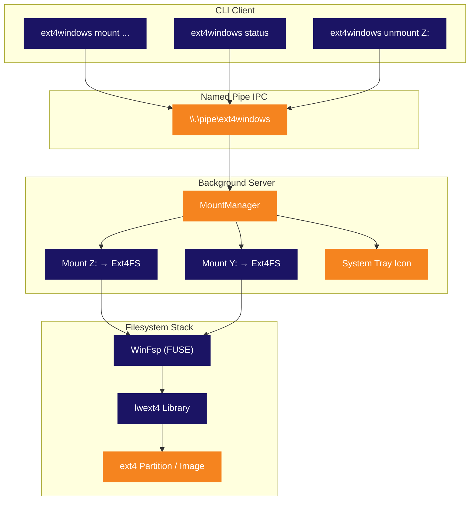

<p align="center">
  
</p>

<p align="center">
  <strong>Mounte ext4-Linux-Partitionen als native Windows-Laufwerksbuchstaben.</strong><br>
  <sub>Keine VM. Kein WSL. Kein Aufwand. Einfach anschließen und durchsuchen.</sub>
</p>

<p align="center">
  
  
  
  
  
  
</p>

<p align="center">
  
  
  
  
</p>

<p align="center">
  🌍 <a href="../README.md">English</a> · <a href="README.pt-BR.md">Português</a> · <a href="README.es.md">Español</a> · <strong>Deutsch</strong> · <a href="README.fr.md">Français</a> · <a href="README.zh.md">中文</a> · <a href="README.ja.md">日本語</a> · <a href="README.ru.md">Русский</a>
</p>

<p align="center">
  <a href="#schnellstart"><kbd> <br> Schnellstart <br> </kbd></a>&nbsp;&nbsp;
  <a href="#installation"><kbd> <br> Installation <br> </kbd></a>&nbsp;&nbsp;
  <a href="#aus-quellcode-bauen"><kbd> <br> Aus Quellcode bauen <br> </kbd></a>&nbsp;&nbsp;
  <a href="https://github.com/Mateuscruz19/Ext4Windows/issues"><kbd> <br> Fehler melden <br> </kbd></a>
</p>

<br>

<p align="center">
  
</p>

<br>

## Das Problem

Dual-Boot mit Linux und Windows ist weit verbreitet. Aber auf die Linux-Dateien von Windows aus zugreifen? **Schmerzhaft.**

Windows hat **keinerlei** native ext4-Unterstützung. Deine Linux-Partition ist unsichtbar. Deine Dateien stecken hinter einem Dateisystem, das Windows sich weigert zu lesen.

Die vorhandenen Lösungen haben alle gravierende Nachteile:

| Werkzeug | Problem |
|:---------|:--------|
| **Ext2Fsd** | Seit 2017 nicht mehr gepflegt. Kernel-Mode-Treiber = BSOD-Risiko. Keine ext4-Extent-Unterstützung. |
| **Paragon ExtFS** | Kostenpflichtige Software (40$+). Closed Source. |
| **DiskInternals Reader** | Nur Lesezugriff. Kein drive letter — Dateien werden über eine umständliche eigene Oberfläche aufgerufen. |
| **WSL `wsl --mount`** | Läuft innerhalb einer Hyper-V-VM. Erfordert Administratorrechte. Kein echter drive letter. Dateizugriff über den `\\wsl$\`-Pfad. |

<br>

## Die Lösung

**Ext4Windows** mountet ext4-Dateisysteme als **echte Windows-Laufwerksbuchstaben**. Deine Linux-Dateien erscheinen im Explorer, genau wie jedes USB-Laufwerk. Öffnen, bearbeiten, kopieren, löschen — alles funktioniert nativ.

```
C:\> ext4windows mount D:\linux.img
  OK Mounted D:\linux.img on Z: (read-only)
```

Deine ext4-Dateien sind jetzt auf **Z:** — durchsuche sie im Explorer, öffne sie in jeder App, per Drag & Drop. Fertig.

<br>

<p align="center">
  
</p>

<br>

## Funktionen

<table>
<tr>
<td width="50%" valign="top">

### Kern
- ext4-Images (`.img`) als drive letters mounten
- Rohe ext4-Partitionen von physischen Datenträgern mounten
- Vollständiger **Lesezugriff** — Dateien, Verzeichnisse, Symlinks
- Vollständiger **Schreibzugriff** — erstellen, bearbeiten, löschen, kopieren, umbenennen
- Mehrere gleichzeitige Mounts (Z:, Y:, X:, ...)

</td>
<td width="50%" valign="top">

### Architektur
- Hintergrund-Server mit **System-Tray-Symbol**
- CLI-Client für Scripting und Automatisierung
- Named Pipe IPC für schnelle Client-Server-Kommunikation
- Automatischer Serverstart beim ersten mount-Befehl
- Sauberes Aufräumen beim unmount/Auswerfen

</td>
</tr>
<tr>
<td width="50%" valign="top">

### Benutzerfreundlichkeit
- **Automatische Erkennung** von ext4-Partitionen mit `scan`
- Automatische Auswahl freier drive letters (Z: abwärts bis D:)
- Rechtsklick auf das Tray-Symbol zum unmount oder Beenden
- Legacy-Einzelmodus für einfache Nutzung
- Debug-Protokollierung zur Fehlerbehebung

</td>
<td width="50%" valign="top">

### Technik
- Userspace-Treiber — kein Kernel-Modul, kein BSOD-Risiko
- Instanz-spezifische ext4-Gerätenamen (Multi-Mount-sicher)
- Globaler mutex für lwext4 Thread-Sicherheit
- Open-per-Operation-Muster (keine Handle-Lecks)
- Ghost-Mount-Erkennung und automatisches Aufräumen

</td>
</tr>
</table>

<br>

<p align="center">
  
</p>

<br>

## Vergleich

Wie schlägt sich Ext4Windows im Vergleich zu den Alternativen?

| Funktion | Ext4Windows | Ext2Fsd | DiskInternals | Paragon | WSL `--mount` |
|:---------|:-----------:|:-------:|:-------------:|:-------:|:-------------:|
| **Echter drive letter** | ✅ | ✅ | ❌ | ✅ | ❌ |
| **Lesezugriff** | ✅ | ✅ | ✅ | ✅ | ✅ |
| **Schreibzugriff** | ✅ | ⚠️ Teilweise | ❌ | ✅ | ✅ |
| **ext4-Extents** | ✅ | ❌ | ✅ | ✅ | ✅ |
| **Kein Neustart nötig** | ✅ | ❌ | ✅ | ✅ | ✅ |
| **Keine Adminrechte nötig** | ✅ | ❌ | ✅ | ❌ | ❌ |
| **System-Tray-GUI** | ✅ | ❌ | ✅ | ✅ | ❌ |
| **Open Source** | ✅ | ✅ | ❌ | ❌ | ❌ |
| **Aktiv gepflegt** | ✅ | ❌ (2017) | ❌ | ✅ | ✅ |
| **Userspace (kein BSOD)** | ✅ | ❌ | ✅ | ❌ | ✅ |
| **Kostenlos** | ✅ | ✅ | ✅ | ❌ (40$+) | ✅ |

<br>

<p align="center">
  
</p>

<br>

## Schnellstart

### Ein ext4-Image mounten

```bash
# Nur-Lesen mounten (Standard) — drive letter wird automatisch gewählt
ext4windows mount path\to\image.img

# Auf einen bestimmten drive letter mounten
ext4windows mount path\to\image.img X:

# Mit Schreibzugriff mounten
ext4windows mount path\to\image.img --rw

# Mit Schreibzugriff auf bestimmten drive letter mounten
ext4windows mount path\to\image.img X: --rw
```

### Mounts verwalten

```bash
# Prüfen was gemountet ist
ext4windows status

# Ein Laufwerk unmounten
ext4windows unmount Z:

# Nach ext4-Partitionen auf physischen Datenträgern suchen (erfordert Admin)
ext4windows scan

# Den Hintergrund-Server beenden
ext4windows quit
```

### Legacy-Modus

Für schnelle Einzelnutzung ohne die Client-Server-Architektur:

```bash
# Mounten und blockieren bis Strg+C
ext4windows path\to\image.img Z:

# Im Legacy-Modus mit Schreibzugriff mounten
ext4windows path\to\image.img Z: --rw
```

<br>

<p align="center">
  
</p>

<br>

## Architektur

Ext4Windows verwendet eine **Client-Server-Architektur**. Der erste `mount`-Befehl startet automatisch einen Hintergrund-Server, der alle Mounts verwaltet und ein System-Tray-Symbol anzeigt.



### Wie ein Datei-Lesevorgang funktioniert

Wenn du eine Datei im Explorer auf dem gemounteten Laufwerk öffnest, passiert Folgendes im Hintergrund:

```
Explorer öffnet Z:\docs\readme.txt
  → Windows-Kernel sendet IRP_MJ_READ an den WinFsp-Treiber
    → WinFsp ruft unseren OnRead-Callback in Ext4FileSystem auf
      → Wir sperren den globalen ext4-mutex
        → lwext4 öffnet die Datei: ext4_fopen("/mnt_Z/docs/readme.txt", "rb")
        → lwext4 liest die angeforderten Bytes: ext4_fread()
        → lwext4 schließt die Datei: ext4_fclose()
      → Wir entsperren den mutex
    → Daten fließen durch WinFsp zurück zum Kernel
  → Explorer zeigt den Dateiinhalt an
```

### System Tray

Der Server erstellt ein **System-Tray-Symbol** (Infobereich) über die reine Win32-API:

- **Überfahre** das Symbol, um die Anzahl der Mounts zu sehen
- **Rechtsklick** zum Anzeigen aktiver Mounts, unmount von Laufwerken oder Beenden
- Das Symbol verwendet das Ext4Windows-Logo (eingebettet in die exe über eine Ressourcen-Datei)
- Wenn ein Laufwerk über den Explorer ausgeworfen wird, erkennt der Server dies und räumt den Ghost-Mount automatisch auf

<br>

<p align="center">
  
</p>

<br>

## Installation

### Voraussetzungen

- **Windows 10 oder 11** (64-Bit)
- **[WinFsp](https://winfsp.dev/rel/)** — lade die neueste Version herunter und installiere sie

### Download

> Releases kommen bald. Vorerst bitte [aus Quellcode bauen](#-aus-quellcode-bauen).

### Funktionsfähigkeit überprüfen

```bash
# Ein ext4-Testimage mit WSL erstellen (falls verfügbar)
wsl -e bash -c "dd if=/dev/zero of=/tmp/test.img bs=1M count=64 && mkfs.ext4 /tmp/test.img"
cp \\wsl$\Ubuntu\tmp\test.img .

# Mounten
ext4windows mount test.img
```

<br>

<p align="center">
  
</p>

<br>

## Aus Quellcode bauen

### Voraussetzungen

| Werkzeug | Version | Zweck |
|:---------|:--------|:------|
| **Windows** | 10 oder 11 | Ziel-Betriebssystem |
| **Visual Studio 2022** | Build Tools oder vollständige IDE | C++-Compiler (MSVC) |
| **CMake** | 3.16+ | Build-System |
| **Git** | Beliebig | Klonen mit Submodulen |
| **[WinFsp](https://winfsp.dev/rel/)** | Neueste | FUSE-Framework + SDK |

> **Hinweis:** Du brauchst die Workload **"Desktopentwicklung mit C++"** in Visual Studio.

### Klonen

```bash
git clone --recursive https://github.com/Mateuscruz19/Ext4Windows.git
cd Ext4Windows
```

> Das Flag `--recursive` ist wichtig — es lädt das **lwext4**-Submodul aus `external/lwext4/` herunter.

### Bauen

Öffne eine **Developer Command Prompt for VS 2022** (oder führe `VsDevCmd.bat` aus), dann:

```bash
mkdir build
cd build
cmake ..
cmake --build .
```

Die ausführbare Datei befindet sich unter `build\ext4windows.exe`.

### Schnelles Build-Skript

Wenn du die VS Build Tools installiert hast, führe einfach aus:

```bash
build.bat
```

Dieses Skript richtet automatisch die VS-Umgebung ein und baut das Projekt.

### Projektstruktur

```
Ext4Windows/
├── assets/                    # Logo und visuelle Ressourcen
│   ├── ext4windows.ico        # Anwendungssymbol (mehrere Größen)
│   ├── logo_icon.png          # Logo ohne Text
│   └── logo_with_text.png     # Logo mit "Ext4Windows"-Text
├── cmake/                     # CMake-Module (FindWinFsp)
├── external/
│   └── lwext4/                # lwext4-Submodul (ext4-Implementierung)
├── src/
│   ├── main.cpp               # Einstiegspunkt und Argument-Routing
│   ├── ext4_filesystem.cpp/hpp  # WinFsp-Dateisystem-Callbacks
│   ├── server.cpp/hpp         # Hintergrund-Server + MountManager
│   ├── client.cpp/hpp         # CLI-Client
│   ├── tray_icon.cpp/hpp      # System-Tray-Symbol (Win32)
│   ├── pipe_protocol.hpp      # Named Pipe IPC-Protokoll
│   ├── blockdev_file.cpp/hpp  # Block Device aus .img-Datei
│   ├── blockdev_partition.cpp/hpp  # Block Device aus roher Partition
│   ├── partition_scanner.cpp/hpp   # Automatische ext4-Partitionserkennung
│   ├── debug_log.hpp          # Debug-Protokollierungshilfsmittel
│   └── ext4windows.rc         # Windows-Ressourcen-Datei (Symbol)
├── CMakeLists.txt             # Build-Konfiguration
├── build.bat                  # Schnelles Build-Skript
└── LICENSE                    # GPL-2.0
```

<br>

<p align="center">
  
</p>

<br>

## Technologie-Stack

<table>
<tr>
<td align="center" width="150">
  
  <br><sub>Kernsprache</sub>
</td>
<td align="center" width="150">
  
  <br><sub>Virtuelles Dateisystem</sub>
</td>
<td align="center" width="150">
  
  <br><sub>ext4-Implementierung</sub>
</td>
<td align="center" width="150">
  
  <br><sub>Tray, Pipes, Prozesse</sub>
</td>
<td align="center" width="150">
  
  <br><sub>Build-System</sub>
</td>
</tr>
</table>

| Bibliothek | Rolle | Link |
|:-----------|:------|:-----|
| **WinFsp** | Windows-FUSE-Framework. Erstellt virtuelle Dateisysteme, die als echte Laufwerke erscheinen. Übernimmt die gesamte Kernel-Kommunikation — wir implementieren nur Callbacks (OnRead, OnWrite, OnCreate, usw.) | [winfsp.dev](https://winfsp.dev) |
| **lwext4** | Portable ext4-Dateisystembibliothek in reinem C. Liest und schreibt das ext4-Festplattenformat: Superblock, Blockgruppen, Inodes, Extents, Verzeichniseinträge. Wird als Submodul verwendet. | [github.com/gkostka/lwext4](https://github.com/gkostka/lwext4) |
| **Win32-API** | Native Windows-APIs für System-Tray-Symbol (`Shell_NotifyIconW`), Named Pipes (`CreateNamedPipeW`), Prozessverwaltung (`CreateProcessW`) und drive-letter-Erkennung (`GetLogicalDrives`). | [learn.microsoft.com](https://learn.microsoft.com/en-us/windows/win32/) |

<br>

<p align="center">
  
</p>

<br>

## Sicherheit & Speichersicherheit

Ext4Windows wird mit vier unabhängigen Analysetools geprüft. Alle Tests werden bei jedem Release durchgeführt.

<table>
<tr>
<th>Werkzeug</th>
<th>Was es prüft</th>
<th>Ergebnis</th>
</tr>
<tr>
<td><strong>AddressSanitizer (ASan)</strong><br><sub><code>/fsanitize=address</code></sub></td>
<td>Pufferüberläufe, Use-after-free, Stack-Korruption, Heap-Korruption — erkannt zur Laufzeit während eines vollständigen mount → Lesen → Schreiben → unmount → Beenden-Zyklus</td>
<td><strong>BESTANDEN — 0 Fehler</strong></td>
</tr>
<tr>
<td><strong>MSVC Code Analysis</strong><br><sub><code>/analyze</code></sub></td>
<td>Statische Analyse auf Null-Pointer-Dereferenzierungen, Pufferüberläufe, nicht initialisierten Speicher, Integer-Überläufe, Sicherheits-Anti-Patterns (C6000–C28000 Regeln)</td>
<td><strong>BESTANDEN — 0 Schwachstellen</strong><br><sub>7 informative Warnungen (Handle-Null-Prüfungen — alle zur Laufzeit abgesichert)</sub></td>
</tr>
<tr>
<td><strong>CppCheck 2.20</strong><br><sub><code>--enable=all --inconclusive</code></sub></td>
<td>Unabhängiger statischer Analysator (183 Prüfregeln): Pufferüberläufe, Null-Dereferenzierungen, Ressourcen-Lecks, nicht initialisierte Variablen, Portabilitätsprobleme</td>
<td><strong>BESTANDEN — 0 Bugs, 0 Schwachstellen</strong><br><sub>Nur stilistische Vorschläge (const-Korrektheit, ungenutzte Variablen)</sub></td>
</tr>
<tr>
<td><strong>CRT Debug Heap</strong><br><sub><code>_CrtDumpMemoryLeaks</code></sub></td>
<td>Speicherlecks — verfolgt jeden <code>new</code>/<code>malloc</code>-Aufruf und meldet alles, was beim Beenden nicht freigegeben wurde. Getestet: blockdev erstellen/zerstören, vollständiger ext4 mount/Lesen/unmount-Zyklus</td>
<td><strong>BESTANDEN — 0 Lecks</strong></td>
</tr>
</table>

### Sicherheitshärtungsmaßnahmen

| Schutzmaßnahme | Beschreibung |
|:---------------|:-------------|
| **Named Pipe ACL** | Pipe ist über SDDL `D:(A;;GA;;;CU)` auf den erstellenden Benutzer beschränkt — andere Benutzer des Systems können keine Befehle senden |
| **Path-Traversal-Schutz** | Alle Pfade werden vor der Verarbeitung auf `..`-Sequenzen und Null-Bytes geprüft |
| **Drive-letter-Validierung** | Nur `A-Z` werden als drive letters in MOUNT/MOUNT_PARTITION-Befehlen akzeptiert |
| **Integer-Overflow-Schutz** | Block-Lese-/Schreibgrößen werden vor der Multiplikation geprüft, um DWORD-Überläufe zu verhindern |
| **Expliziter Prozesspfad** | `CreateProcessW` verwendet einen expliziten exe-Pfad (kein PATH-Search-Hijacking) |
| **Begrenzte String-Kopien** | Alle `wcscpy` durch `wcsncpy` + Null-Terminator ersetzt, um Pufferüberläufe zu verhindern |
| **Userspace-Treiber** | Kein Kernel-Modul — ein Absturz kann keinen BSOD oder Systemspeicher-Korruption verursachen |

<br>

<p align="center">
  
</p>

<br>

## Fahrplan

### Erledigt

- [x] ext4-Image-Dateien als Windows-Laufwerksbuchstaben mounten
- [x] Vollständiger Lesezugriff — Dateien, Verzeichnisse, Symlinks
- [x] Vollständiger Schreibzugriff — erstellen, bearbeiten, löschen, kopieren, umbenennen
- [x] Automatische Erkennung von ext4-Partitionen auf physischen Datenträgern
- [x] Client-Server-Architektur mit Hintergrund-Daemon
- [x] System-Tray-Symbol mit Kontextmenü
- [x] Mehrere gleichzeitige Mounts
- [x] Named Pipe IPC-Protokoll
- [x] Automatischer Serverstart beim ersten mount
- [x] Ghost-Mount-Erkennung (automatisches Aufräumen beim Auswerfen)
- [x] Debug-Protokollierung (Konsole + Datei)
- [x] Eigenes Anwendungssymbol

### In Bearbeitung

(derzeit nichts)

### Kürzlich abgeschlossen

- [x] Rohe Partitionen über Client-Server mounten (MOUNT_PARTITION + SCAN-Befehle)
- [x] Linux-Berechtigungszuordnung (ext4 Mode-Bits → Windows-Attribute & ACLs)
- [x] Autostart bei Anmeldung (Windows Registry Run Key)
- [x] Dateizeitstempel (ext4 crtime/atime/mtime/ctime → Windows Erstellung/Zugriff/Schreiben/Änderung)
- [x] Journaling-Unterstützung (ext4_recover + ext4_journal_start/stop)
- [x] Leistungsoptimierung (512KB Block-Cache + WinFsp Metadaten-Caching)
- [x] Unterstützung großer Dateien (>4GB mit 64-Bit-Blockberechnungen)
- [x] Installer (Inno Setup) und portable Version (.zip)

### Geplant

- [x] Einstellungspanel (terminalbasiert, in Konfigurationsdatei gespeichert)

<br>

<p align="center">
  
</p>

<br>

<details>
<summary><h2>FAQ</h2></summary>

### Ist das sicher? Kann es meine Linux-Partition beschädigen?

Ext4Windows läuft vollständig im **Userspace** (dank WinFsp), sodass es keinen Blue Screen of Death (BSOD) verursachen kann. Der Code wird mit AddressSanitizer, statischer MSVC-Analyse und CRT-Leak-Erkennung geprüft — siehe [Sicherheit & Speichersicherheit](#sicherheit--speichersicherheit). Aus Sicherheitsgründen ist der Standard-Mount-Modus **nur Lesen**. Der Schreibmodus (`--rw`) beinhaltet ext4-Journaling-Unterstützung für Crash-Recovery. Erstelle immer Backups.

### Brauche ich Administratorrechte?

**Nein** — zum Mounten von Image-Dateien (`.img`) werden keine Adminrechte benötigt. Der `scan`-Befehl (der physische Datenträger durchsucht) erfordert Adminrechte, da er auf rohe Datenträgergeräte (`\\.\PhysicalDrive0`, usw.) zugreifen muss. Das Programm fordert bei Bedarf automatisch zur UAC-Erhöhung auf.

### Welche ext4-Funktionen werden unterstützt?

lwext4 unterstützt die zentralen ext4-Funktionen: Extents, 64-Bit-Blockadressierung, Verzeichnisindizierung (htree), Metadaten-Prüfsummen und Journaling (Recovery + Schreibtransaktionen). **Nicht** unterstützte Funktionen: Inline Data, Verschlüsselung und Verity.

### Kann ich ext2- oder ext3-Partitionen mounten?

Ja! ext4 ist abwärtskompatibel mit ext2 und ext3. lwext4 kann alle drei Formate lesen.

### Funktioniert es mit Dual-Boot-Linux-Partitionen?

Ja, das ist der primäre Anwendungsfall. Verwende `ext4windows scan`, um deine Linux-Partition zu finden und zu mounten. **Wichtig:** Mounte deine Linux-Root-Partition nicht mit `--rw`, solange Linux sie möglicherweise nutzt (z.B. wenn du WSL ausführst). Das kann zu Datenverlust führen.

### Warum nicht einfach WSL `wsl --mount` verwenden?

WSL mountet Partitionen innerhalb einer Hyper-V-VM. Die Dateien sind nur über den Netzwerkpfad `\\wsl$\` erreichbar, nicht als echter drive letter. Es erfordert Adminrechte, hat höheren Overhead und integriert sich nicht auf dieselbe Weise in den Windows Explorer wie ein echtes Laufwerk.

### Kann ich das mit USB-Laufwerken verwenden, die als ext4 formatiert sind?

Ja! Verwende `ext4windows scan`, um die ext4-Partition auf dem USB-Laufwerk zu erkennen, und mounte sie dann.

### Das Tray-Symbol ist verschwunden. Was ist passiert?

Der Server ist möglicherweise abgestürzt oder wurde beendet. Führe `ext4windows status` aus — wenn der Server nicht läuft, wird der nächste `mount`-Befehl ihn automatisch starten.

### Wie aktiviere ich die Debug-Protokollierung?

Füge `--debug` zu jedem Befehl hinzu:

```bash
ext4windows mount image.img --debug
```

Für den Server werden Debug-Protokolle nach `%TEMP%\ext4windows_server.log` geschrieben.

</details>

<br>

<details>
<summary><h2>Fehlerbehebung</h2></summary>

### "Error: could not start server"

Der Serverprozess konnte nicht gestartet werden. Mögliche Ursachen:
- Eine andere Instanz läuft bereits — versuche zuerst `ext4windows quit`
- Ein Antivirusprogramm blockiert den Prozess — füge eine Ausnahme für `ext4windows.exe` hinzu
- WinFsp ist nicht installiert — lade es von [winfsp.dev/rel](https://winfsp.dev/rel/) herunter

### "Error: server did not start in time"

Der Server wurde gestartet, aber die Named Pipe wurde nicht innerhalb von 3 Sekunden erstellt. Das kann passieren, wenn:
- Die WinFsp-DLL (`winfsp-x64.dll`) nicht gefunden wird — stelle sicher, dass sie im selben Verzeichnis wie `ext4windows.exe` liegt oder WinFsp systemweit installiert ist
- Das System stark ausgelastet ist — versuche es erneut

### "Mount failed (status=0xC00000XX)"

WinFsp hat beim mount einen Fehler zurückgegeben. Häufige Fehlercodes:
- `0xC0000034` — drive letter wird bereits von einem anderen Programm verwendet
- `0xC0000022` — Zugriff verweigert (versuche es als Administrator)
- `0xC000000F` — Datei nicht gefunden (überprüfe den Image-Pfad)

### "Error: server is busy, try again"

Der Server verarbeitet einen Befehl nach dem anderen. Wenn gerade ein anderer Client kommuniziert, erhältst du diesen Fehler. Versuche es einfach erneut.

### Dateien zeigen 0 Bytes oder lassen sich nicht öffnen

Das bedeutet in der Regel, dass das ext4-Image beschädigt ist oder nicht unterstützte Funktionen verwendet. Versuche:
1. Überprüfe das Image mit `fsck.ext4` in Linux/WSL
2. Aktiviere die Debug-Protokollierung (`--debug`), um den genauen Fehler zu sehen
3. Versuche zuerst, im Nur-Lesen-Modus zu mounten (entferne `--rw`)

### Laufwerk ist aus dem Explorer verschwunden

Wenn du das Laufwerk über den Explorer auswirfst (Rechtsklick → Auswerfen), erkennt der Server dies und räumt automatisch auf. Führe `ext4windows status` zur Bestätigung aus. Zum erneuten Mounten führe den mount-Befehl einfach wieder aus.

</details>

<br>

<p align="center">
  
</p>

<br>

## Mitwirken

Beiträge sind willkommen! Dieses Projekt wird aktiv entwickelt und es gibt viel zu tun.

1. **Forke** das Repository
2. **Erstelle** einen Feature-Branch (`git checkout -b feature/amazing-thing`)
3. **Committe** deine Änderungen
4. **Pushe** zum Branch
5. **Öffne** einen Pull Request

Schau dir den [Fahrplan](#fahrplan) an, um Ideen zu finden, woran du arbeiten könntest. Öffne gerne ein Issue zur Diskussion, bevor du mit größeren Änderungen beginnst.

<br>

## Lizenz

Dieses Projekt ist unter der **GNU General Public License v2.0** lizenziert — siehe die [LICENSE](LICENSE)-Datei für Details.

<br>

<p align="center">
  
</p>

<p align="center">
  <sub>Gebaut mit WinFsp und lwext4. Logo inspiriert vom Linux-Pinguin-Fußabdruck und dem Windows-Fenster.</sub>
</p>
