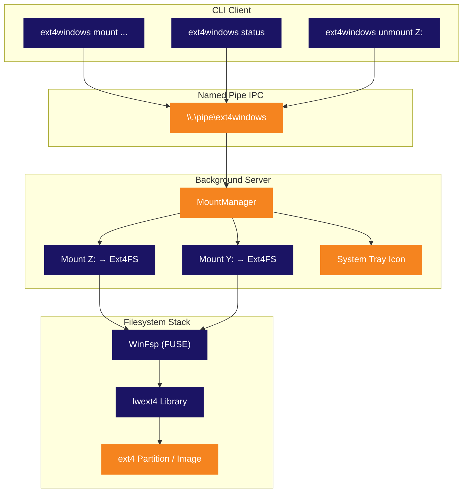

<p align="center">
  
</p>

<p align="center">
  <strong>Monta particiones ext4 de Linux como letras de unidad nativas de Windows.</strong><br>
  <sub>Sin VM. Sin WSL. Sin complicaciones. Conecta y navega.</sub>
</p>

<p align="center">
  
  
  
  
  
  
</p>

<p align="center">
  
  
  
  
</p>

<p align="center">
  <sub>🌍 <a href="../README.md">English</a> · <a href="README.pt-BR.md">Português</a> · <strong>Español</strong> · <a href="README.de.md">Deutsch</a> · <a href="README.fr.md">Français</a> · <a href="README.zh.md">中文</a> · <a href="README.ja.md">日本語</a> · <a href="README.ru.md">Русский</a></sub>
</p>

<p align="center">
  <a href="#inicio-rápido"><kbd> <br> Inicio Rápido <br> </kbd></a>&nbsp;&nbsp;
  <a href="#instalación"><kbd> <br> Instalación <br> </kbd></a>&nbsp;&nbsp;
  <a href="#compilar-desde-código"><kbd> <br> Compilar desde Código <br> </kbd></a>&nbsp;&nbsp;
  <a href="https://github.com/Mateuscruz19/Ext4Windows/issues"><kbd> <br> Reportar Bug <br> </kbd></a>
</p>

<br>

<p align="center">
  
</p>

<br>

## El Problema

Arranque dual con Linux y Windows es algo común. ¿Acceder a tus archivos de Linux desde Windows? **Doloroso.**

Windows tiene **cero** soporte nativo para ext4. Tu partición de Linux es invisible. Tus archivos están atrapados detrás de un sistema de archivos que Windows se niega a leer.

Las soluciones existentes tienen serios inconvenientes:

| Herramienta | Problema |
|:-----|:--------|
| **Ext2Fsd** | Abandonado desde 2017. Driver en modo kernel = riesgo de BSOD. Sin soporte para ext4 extents. |
| **Paragon ExtFS** | Software de pago ($40+). Código cerrado. |
| **DiskInternals Reader** | Solo lectura. Sin drive letter — los archivos se acceden a través de una interfaz personalizada tosca. |
| **WSL `wsl --mount`** | Se ejecuta dentro de una VM Hyper-V. Requiere administrador. No es un drive letter real. Los archivos se acceden mediante la ruta `\\wsl$\`. |

<br>

## La Solución

**Ext4Windows** monta sistemas de archivos ext4 como **drive letters reales de Windows**. Tus archivos de Linux aparecen en el Explorador, igual que cualquier unidad USB. Abrir, editar, copiar, eliminar — todo funciona nativamente.

```
C:\> ext4windows mount D:\linux.img
  OK Mounted D:\linux.img on Z: (read-only)
```

Tus archivos ext4 ahora están en **Z:** — navégalos en el Explorador, ábrelos en cualquier aplicación, arrastra y suelta. Listo.

<br>

<p align="center">
  
</p>

<br>

## Características

<table>
<tr>
<td width="50%" valign="top">

### Núcleo
- Montar imágenes ext4 (`.img`) como drive letters
- Montar particiones ext4 raw de discos físicos
- Soporte completo de **lectura** — archivos, directorios, symlinks
- Soporte completo de **escritura** — crear, editar, eliminar, copiar, renombrar
- Múltiples montajes simultáneos (Z:, Y:, X:, ...)

</td>
<td width="50%" valign="top">

### Arquitectura
- Servidor en segundo plano con **icono en la bandeja del sistema**
- Cliente CLI para scripting y automatización
- Named Pipe IPC para comunicación rápida cliente-servidor
- Inicio automático del servidor en el primer comando mount
- Limpieza elegante al expulsar/unmount

</td>
</tr>
<tr>
<td width="50%" valign="top">

### Usabilidad
- **Auto-detección** de particiones ext4 con `scan`
- Selección automática de drive letter libre (Z: hacia abajo hasta D:)
- Clic derecho en el icono de bandeja para unmount o salir
- Modo legacy de un solo uso para uso simple
- Registro de depuración para resolución de problemas

</td>
<td width="50%" valign="top">

### Técnico
- Driver en espacio de usuario — sin módulo kernel, sin riesgo de BSOD
- Nombres de dispositivo ext4 por instancia (seguro para multi-mount)
- Mutex global para seguridad de hilos de lwext4
- Patrón abrir-por-operación (sin fugas de handles)
- Detección de mount fantasma y limpieza automática

</td>
</tr>
</table>

<br>

<p align="center">
  
</p>

<br>

## Comparación

¿Cómo se compara Ext4Windows con las alternativas?

| Característica | Ext4Windows | Ext2Fsd | DiskInternals | Paragon | WSL `--mount` |
|:--------|:-----------:|:-------:|:-------------:|:-------:|:-------------:|
| **Drive letter real** | ✅ | ✅ | ❌ | ✅ | ❌ |
| **Soporte de lectura** | ✅ | ✅ | ✅ | ✅ | ✅ |
| **Soporte de escritura** | ✅ | ⚠️ Parcial | ❌ | ✅ | ✅ |
| **ext4 extents** | ✅ | ❌ | ✅ | ✅ | ✅ |
| **Sin reinicio necesario** | ✅ | ❌ | ✅ | ✅ | ✅ |
| **Sin admin requerido** | ✅ | ❌ | ✅ | ❌ | ❌ |
| **GUI en bandeja del sistema** | ✅ | ❌ | ✅ | ✅ | ❌ |
| **Código abierto** | ✅ | ✅ | ❌ | ❌ | ❌ |
| **Mantenido activamente** | ✅ | ❌ (2017) | ❌ | ✅ | ✅ |
| **Espacio de usuario (sin BSOD)** | ✅ | ❌ | ✅ | ❌ | ✅ |
| **Gratuito** | ✅ | ✅ | ✅ | ❌ ($40+) | ✅ |

<br>

<p align="center">
  
</p>

<br>

## Inicio Rápido

### Montar una imagen ext4

```bash
# Montar en solo lectura (por defecto) — selección automática de drive letter
ext4windows mount path\to\image.img

# Montar en un drive letter específico
ext4windows mount path\to\image.img X:

# Montar con soporte de escritura
ext4windows mount path\to\image.img --rw

# Montar con escritura en una letra específica
ext4windows mount path\to\image.img X: --rw
```

### Gestionar montajes

```bash
# Ver qué está montado
ext4windows status

# Desmontar una unidad
ext4windows unmount Z:

# Escanear particiones ext4 en discos físicos (requiere admin)
ext4windows scan

# Apagar el servidor en segundo plano
ext4windows quit
```

### Modo legacy

Para un uso rápido sin la arquitectura cliente-servidor:

```bash
# Montar y bloquear hasta Ctrl+C
ext4windows path\to\image.img Z:

# Montar en modo lectura-escritura en modo legacy
ext4windows path\to\image.img Z: --rw
```

<br>

<p align="center">
  
</p>

<br>

## Arquitectura

Ext4Windows utiliza una **arquitectura cliente-servidor**. El primer comando `mount` inicia automáticamente un servidor en segundo plano, que gestiona todos los montajes y muestra un icono en la bandeja del sistema.



### Cómo funciona la lectura de un archivo

Cuando abres un archivo en el Explorador en la unidad montada, esto es lo que sucede internamente:

```
El Explorador abre Z:\docs\readme.txt
  → El kernel de Windows envía IRP_MJ_READ al driver WinFsp
    → WinFsp llama a nuestro callback OnRead en Ext4FileSystem
      → Bloqueamos el mutex global de ext4
        → lwext4 abre el archivo: ext4_fopen("/mnt_Z/docs/readme.txt", "rb")
        → lwext4 lee los bytes solicitados: ext4_fread()
        → lwext4 cierra el archivo: ext4_fclose()
      → Desbloqueamos el mutex
    → Los datos fluyen de vuelta a través de WinFsp al kernel
  → El Explorador muestra el contenido del archivo
```

### Bandeja del sistema

El servidor crea un **icono en la bandeja del sistema** (área de notificaciones) utilizando la API pura de Win32:

- **Pasa el cursor** sobre el icono para ver la cantidad de montajes
- **Clic derecho** para ver los montajes activos, desmontar unidades o salir
- El icono utiliza el logo de Ext4Windows (integrado en el exe mediante un archivo de recursos)
- Si una unidad se expulsa desde el Explorador, el servidor lo detecta y limpia automáticamente el mount fantasma

<br>

<p align="center">
  
</p>

<br>

## Instalación

### Requisitos previos

- **Windows 10 u 11** (64 bits)
- **[WinFsp](https://winfsp.dev/rel/)** — descarga e instala la última versión

### Descargar

> Las versiones compiladas estarán disponibles pronto. Por ahora, [compila desde el código fuente](#-compilar-desde-código).

### Verificar que funciona

```bash
# Crear una imagen ext4 de prueba usando WSL (si está disponible)
wsl -e bash -c "dd if=/dev/zero of=/tmp/test.img bs=1M count=64 && mkfs.ext4 /tmp/test.img"
cp \\wsl$\Ubuntu\tmp\test.img .

# Montarla
ext4windows mount test.img
```

<br>

<p align="center">
  
</p>

<br>

## Compilar desde Código

### Requisitos previos

| Herramienta | Versión | Propósito |
|:-----|:--------|:--------|
| **Windows** | 10 u 11 | Sistema operativo objetivo |
| **Visual Studio 2022** | Build Tools o IDE completo | Compilador de C++ (MSVC) |
| **CMake** | 3.16+ | Sistema de compilación |
| **Git** | Cualquiera | Clonar con submódulos |
| **[WinFsp](https://winfsp.dev/rel/)** | Última | Framework FUSE + SDK |

> **Nota:** Necesitas la carga de trabajo **"Desarrollo de escritorio con C++"** en Visual Studio.

### Clonar

```bash
git clone --recursive https://github.com/Mateuscruz19/Ext4Windows.git
cd Ext4Windows
```

> El flag `--recursive` es importante — descarga el submódulo **lwext4** desde `external/lwext4/`.

### Compilar

Abre un **Developer Command Prompt for VS 2022** (o ejecuta `VsDevCmd.bat`), luego:

```bash
mkdir build
cd build
cmake ..
cmake --build .
```

El ejecutable estará en `build\ext4windows.exe`.

### Script de compilación rápida

Si tienes VS Build Tools instalado, simplemente ejecuta:

```bash
build.bat
```

Este script configura automáticamente el entorno de VS y compila.

### Estructura del proyecto

```
Ext4Windows/
├── assets/                    # Logo y recursos visuales
│   ├── ext4windows.ico        # Icono de la aplicación (multi-tamaño)
│   ├── logo_icon.png          # Logo sin texto
│   └── logo_with_text.png     # Logo con texto "Ext4Windows"
├── cmake/                     # Módulos CMake (FindWinFsp)
├── external/
│   └── lwext4/                # Submódulo lwext4 (implementación ext4)
├── src/
│   ├── main.cpp               # Punto de entrada y enrutamiento de argumentos
│   ├── ext4_filesystem.cpp/hpp  # Callbacks del sistema de archivos WinFsp
│   ├── server.cpp/hpp         # Servidor en segundo plano + MountManager
│   ├── client.cpp/hpp         # Cliente CLI
│   ├── tray_icon.cpp/hpp      # Icono de bandeja del sistema (Win32)
│   ├── pipe_protocol.hpp      # Protocolo Named Pipe IPC
│   ├── blockdev_file.cpp/hpp  # Block device desde archivo .img
│   ├── blockdev_partition.cpp/hpp  # Block device desde partición raw
│   ├── partition_scanner.cpp/hpp   # Auto-detección de particiones ext4
│   ├── debug_log.hpp          # Utilidades de registro de depuración
│   └── ext4windows.rc         # Archivo de recursos de Windows (icono)
├── CMakeLists.txt             # Configuración de compilación
├── build.bat                  # Script de compilación rápida
└── LICENSE                    # GPL-2.0
```

<br>

<p align="center">
  
</p>

<br>

## Stack Tecnológico

<table>
<tr>
<td align="center" width="150">
  
  <br><sub>Lenguaje principal</sub>
</td>
<td align="center" width="150">
  
  <br><sub>Sistema de archivos virtual</sub>
</td>
<td align="center" width="150">
  
  <br><sub>Implementación ext4</sub>
</td>
<td align="center" width="150">
  
  <br><sub>Bandeja, pipes, procesos</sub>
</td>
<td align="center" width="150">
  
  <br><sub>Sistema de compilación</sub>
</td>
</tr>
</table>

| Biblioteca | Rol | Enlace |
|:--------|:-----|:-----|
| **WinFsp** | Framework FUSE para Windows. Crea sistemas de archivos virtuales que aparecen como unidades reales. Gestiona toda la comunicación con el kernel — nosotros solo implementamos callbacks (OnRead, OnWrite, OnCreate, etc.) | [winfsp.dev](https://winfsp.dev) |
| **lwext4** | Biblioteca portable de sistema de archivos ext4 en C puro. Lee y escribe el formato en disco de ext4: superbloque, grupos de bloques, inodos, extents, entradas de directorio. La usamos como submódulo. | [github.com/gkostka/lwext4](https://github.com/gkostka/lwext4) |
| **Win32 API** | APIs nativas de Windows para el icono de bandeja del sistema (`Shell_NotifyIconW`), named pipes (`CreateNamedPipeW`), gestión de procesos (`CreateProcessW`) y detección de drive letters (`GetLogicalDrives`). | [learn.microsoft.com](https://learn.microsoft.com/en-us/windows/win32/) |

<br>

<p align="center">
  
</p>

<br>

## Seguridad y Seguridad de Memoria

Ext4Windows es auditado con cuatro herramientas de análisis independientes. Todas las pruebas se ejecutan en cada versión.

<table>
<tr>
<th>Herramienta</th>
<th>Qué verifica</th>
<th>Resultado</th>
</tr>
<tr>
<td><strong>AddressSanitizer (ASan)</strong><br><sub><code>/fsanitize=address</code></sub></td>
<td>Desbordamientos de buffer, uso después de liberar, corrupción de pila, corrupción de heap — detectados en tiempo de ejecución durante un ciclo completo de mount → lectura → escritura → unmount → quit</td>
<td><strong>APROBADO — 0 errores</strong></td>
</tr>
<tr>
<td><strong>MSVC Code Analysis</strong><br><sub><code>/analyze</code></sub></td>
<td>Análisis estático para desreferencias de punteros nulos, desbordamientos de buffer, memoria no inicializada, desbordamientos de enteros, anti-patrones de seguridad (reglas C6000–C28000)</td>
<td><strong>APROBADO — 0 vulnerabilidades</strong><br><sub>7 advertencias informativas (verificaciones de handles nulos — todos protegidos en tiempo de ejecución)</sub></td>
</tr>
<tr>
<td><strong>CppCheck 2.20</strong><br><sub><code>--enable=all --inconclusive</code></sub></td>
<td>Analizador estático independiente (183 verificadores): desbordamientos de buffer, desreferencias nulas, fugas de recursos, variables no inicializadas, problemas de portabilidad</td>
<td><strong>APROBADO — 0 bugs, 0 vulnerabilidades</strong><br><sub>Solo sugerencias de estilo (corrección de const, variables no usadas)</sub></td>
</tr>
<tr>
<td><strong>CRT Debug Heap</strong><br><sub><code>_CrtDumpMemoryLeaks</code></sub></td>
<td>Fugas de memoria — rastrea cada <code>new</code>/<code>malloc</code> y reporta todo lo que no se liberó al salir. Probado: crear/destruir blockdev, ciclo completo de mount/lectura/unmount de ext4</td>
<td><strong>APROBADO — 0 fugas</strong></td>
</tr>
</table>

### Medidas de endurecimiento de seguridad

| Protección | Descripción |
|:-----------|:------------|
| **ACL de Named Pipe** | Pipe restringido al usuario creador mediante SDDL `D:(A;;GA;;;CU)` — otros usuarios del sistema no pueden enviar comandos |
| **Prevención de path traversal** | Todas las rutas se validan contra secuencias `..` y bytes nulos antes de procesarse |
| **Validación de drive letter** | Solo se aceptan `A-Z` como drive letters en comandos MOUNT/MOUNT_PARTITION |
| **Protecciones contra desbordamiento de enteros** | Los tamaños de lectura/escritura de bloques se verifican antes de la multiplicación para prevenir desbordamiento de DWORD |
| **Ruta explícita del proceso** | `CreateProcessW` usa ruta explícita del exe (sin secuestro de búsqueda en PATH) |
| **Copias de cadenas acotadas** | Todos los `wcscpy` reemplazados por `wcsncpy` + terminador nulo para prevenir desbordamiento de buffer |
| **Driver en espacio de usuario** | Sin módulo kernel — un fallo no puede causar BSOD ni corromper la memoria del sistema |

<br>

<p align="center">
  
</p>

<br>

## Hoja de Ruta

### Completado

- [x] Montar archivos de imagen ext4 como drive letters de Windows
- [x] Soporte completo de lectura — archivos, directorios, symlinks
- [x] Soporte completo de escritura — crear, editar, eliminar, copiar, renombrar
- [x] Auto-detección de particiones ext4 en discos físicos
- [x] Arquitectura cliente-servidor con daemon en segundo plano
- [x] Icono en la bandeja del sistema con menú contextual
- [x] Múltiples montajes simultáneos
- [x] Protocolo Named Pipe IPC
- [x] Inicio automático del servidor en el primer mount
- [x] Detección de mount fantasma (limpieza automática al expulsar)
- [x] Registro de depuración (consola + archivo)
- [x] Icono personalizado de la aplicación

### En Progreso

(nada actualmente)

### Completado Recientemente

- [x] Montar particiones raw mediante cliente-servidor (comandos MOUNT_PARTITION + SCAN)
- [x] Mapeo de permisos de Linux (bits de modo ext4 → atributos de Windows y ACLs)
- [x] Inicio automático al iniciar sesión (clave Run del Registro de Windows)
- [x] Marcas de tiempo de archivos (ext4 crtime/atime/mtime/ctime → creación/acceso/escritura/cambio de Windows)
- [x] Soporte de journaling (ext4_recover + ext4_journal_start/stop)
- [x] Optimización de rendimiento (caché de bloques de 512KB + caché de metadatos de WinFsp)
- [x] Soporte de archivos grandes (>4GB con cálculos de bloques de 64 bits)
- [x] Instalador (Inno Setup) y versión portable (.zip)

### Planificado

- [x] Panel de configuración (basado en terminal, persistido en archivo de configuración)

<br>

<p align="center">
  
</p>

<br>

<details>
<summary><h2>Preguntas Frecuentes</h2></summary>

### ¿Es seguro? ¿Puede corromper mi partición de Linux?

Ext4Windows se ejecuta completamente en **espacio de usuario** (gracias a WinFsp), por lo que no puede causar una Pantalla Azul de la Muerte (BSOD). El código fuente es auditado con AddressSanitizer, análisis estático de MSVC y detección de fugas CRT — consulta [Seguridad y Seguridad de Memoria](#seguridad-y-seguridad-de-memoria). Por seguridad, el modo de montaje predeterminado es **solo lectura**. El modo de escritura (`--rw`) incluye soporte de journaling de ext4 para recuperación ante fallos. Siempre mantén copias de seguridad.

### ¿Necesito privilegios de administrador?

**No** — para montar archivos de imagen (`.img`), no se necesita administrador. El comando `scan` (que escanea discos físicos) sí requiere administrador porque necesita acceder a dispositivos de disco raw (`\\.\PhysicalDrive0`, etc.). El programa solicitará automáticamente la elevación UAC cuando sea necesario.

### ¿Qué características de ext4 son compatibles?

lwext4 soporta las características principales de ext4: extents, direccionamiento de bloques de 64 bits, indexación de directorios (htree), checksums de metadatos y journaling (recuperación + transacciones de escritura). Características **no** soportadas: datos inline, cifrado y verity.

### ¿Puedo montar particiones ext2 o ext3?

¡Sí! ext4 es retrocompatible con ext2 y ext3. lwext4 puede leer los tres formatos.

### ¿Funciona con particiones de Linux en arranque dual?

Sí, ese es el caso de uso principal. Usa `ext4windows scan` para encontrar y montar tu partición de Linux. **Importante:** no montes tu partición raíz de Linux con `--rw` mientras Linux podría estar usándola (por ejemplo, si estás ejecutando WSL). Esto puede causar corrupción de datos.

### ¿Por qué no simplemente usar WSL `wsl --mount`?

WSL monta particiones dentro de una máquina virtual Hyper-V. Los archivos solo son accesibles a través de la ruta de red `\\wsl$\`, no como un drive letter real. Requiere administrador, tiene mayor sobrecarga y no se integra con el Explorador de Windows de la misma manera que una unidad real.

### ¿Puedo usar esto con unidades USB formateadas como ext4?

¡Sí! Usa `ext4windows scan` para detectar la partición ext4 en la unidad USB, y luego móntala.

### El icono de la bandeja desapareció. ¿Qué pasó?

El servidor podría haberse bloqueado o sido terminado. Ejecuta `ext4windows status` — si el servidor no está corriendo, el próximo comando `mount` lo iniciará automáticamente.

### ¿Cómo activo el registro de depuración?

Agrega `--debug` a cualquier comando:

```bash
ext4windows mount image.img --debug
```

Para el servidor, los registros de depuración se escriben en `%TEMP%\ext4windows_server.log`.

</details>

<br>

<details>
<summary><h2>Resolución de Problemas</h2></summary>

### "Error: could not start server"

El proceso del servidor no pudo iniciarse. Posibles causas:
- Otra instancia ya está corriendo — prueba `ext4windows quit` primero
- El antivirus está bloqueando el proceso — agrega una excepción para `ext4windows.exe`
- WinFsp no está instalado — descárgalo desde [winfsp.dev/rel](https://winfsp.dev/rel/)

### "Error: server did not start in time"

El servidor se inició pero el named pipe no se creó en 3 segundos. Esto puede suceder si:
- La DLL de WinFsp (`winfsp-x64.dll`) no se encuentra — asegúrate de que esté en el mismo directorio que `ext4windows.exe` o que WinFsp esté instalado a nivel de sistema
- El sistema está bajo carga pesada — intenta de nuevo

### "Mount failed (status=0xC00000XX)"

WinFsp devolvió un error durante el mount. Códigos comunes:
- `0xC0000034` — Drive letter ya en uso por otro programa
- `0xC0000022` — Permiso denegado (intenta ejecutar como administrador)
- `0xC000000F` — Archivo no encontrado (verifica la ruta de la imagen)

### "Error: server is busy, try again"

El servidor procesa un comando a la vez. Si otro cliente está comunicándose actualmente, recibirás este error. Simplemente reintenta.

### Los archivos muestran 0 bytes o no se pueden abrir

Esto generalmente significa que la imagen ext4 está corrupta o usa características no soportadas. Intenta:
1. Verificar la imagen con `fsck.ext4` en Linux/WSL
2. Activar el registro de depuración (`--debug`) para ver el error específico
3. Intentar montar en solo lectura primero (quitar `--rw`)

### La unidad desapareció del Explorador

Si expulsas la unidad desde el Explorador (clic derecho → Expulsar), el servidor lo detecta y limpia automáticamente. Ejecuta `ext4windows status` para confirmar. Para volver a montar, ejecuta el comando mount de nuevo.

</details>

<br>

<p align="center">
  
</p>

<br>

## Contribuir

¡Las contribuciones son bienvenidas! Este proyecto se desarrolla activamente y hay mucho por hacer.

1. **Haz un fork** del repositorio
2. **Crea** una rama de funcionalidad (`git checkout -b feature/cosa-increible`)
3. **Haz commit** de tus cambios
4. **Haz push** a la rama
5. **Abre** un Pull Request

Consulta la [Hoja de Ruta](#hoja-de-ruta) para ideas sobre en qué trabajar. No dudes en abrir un issue para discutir antes de comenzar cambios grandes.

<br>

## Licencia

Este proyecto está licenciado bajo la **Licencia Pública General de GNU v2.0** — consulta el archivo [LICENSE](LICENSE) para más detalles.

<br>

<p align="center">
  
</p>

<p align="center">
  <sub>Construido con WinFsp y lwext4. Logo inspirado en la huella del pingüino de Linux y la ventana de Windows.</sub>
</p>
