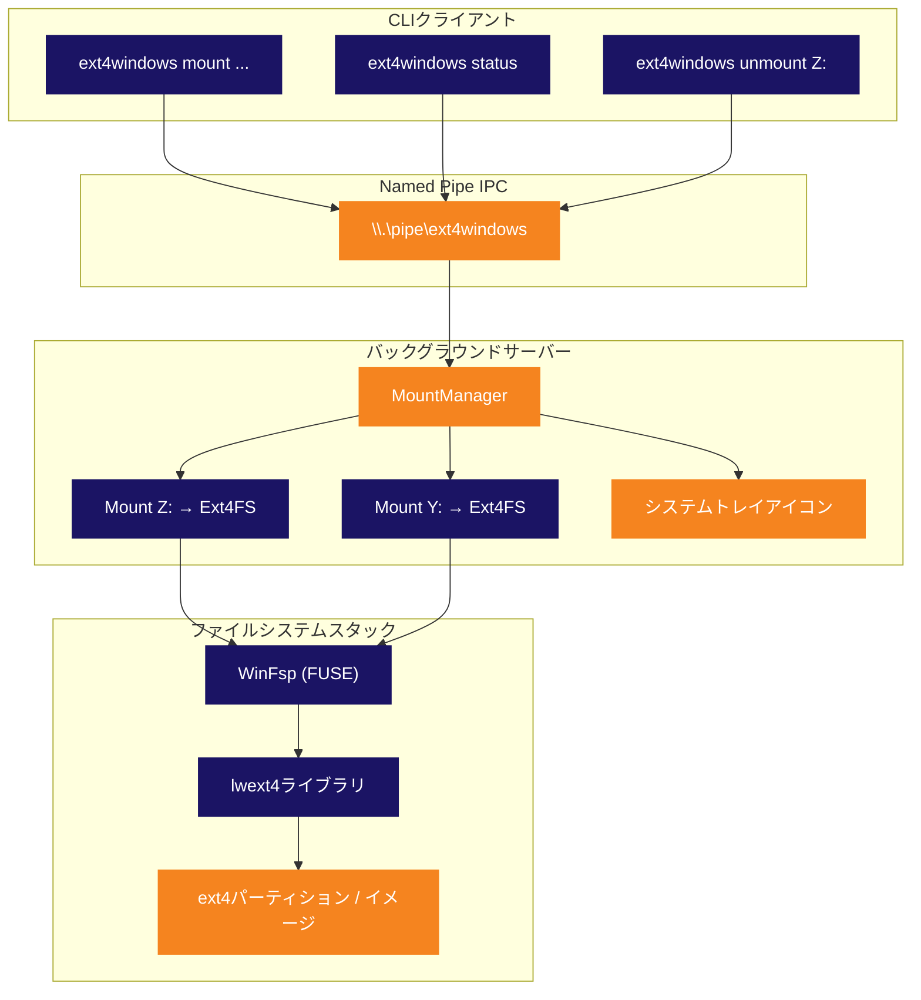

<p align="center">
  
</p>

<p align="center">
  <strong>Linux ext4 パーティションを Windows のネイティブドライブレターとしてマウント。</strong><br>
  <sub>VMなし。WSLなし。面倒なし。接続してすぐ使える。</sub>
</p>

<p align="center">
  
  
  
  
  
  
</p>

<p align="center">
  
  
  
  
</p>

<p align="center">
  <sub>🌍 <a href="../README.md">English</a> · <a href="README.pt-BR.md">Português</a> · <a href="README.es.md">Español</a> · <a href="README.de.md">Deutsch</a> · <a href="README.fr.md">Français</a> · <a href="README.zh.md">中文</a> · <strong>日本語</strong> · <a href="README.ru.md">Русский</a></sub>
</p>

<p align="center">
  <a href="#クイックスタート"><kbd> <br> クイックスタート <br> </kbd></a>&nbsp;&nbsp;
  <a href="#インストール"><kbd> <br> インストール <br> </kbd></a>&nbsp;&nbsp;
  <a href="#ソースからビルド"><kbd> <br> ソースからビルド <br> </kbd></a>&nbsp;&nbsp;
  <a href="https://github.com/Mateuscruz19/Ext4Windows/issues"><kbd> <br> バグを報告 <br> </kbd></a>
</p>

<br>

<p align="center">
  
</p>

<br>

## 問題点

LinuxとWindowsのデュアルブートは一般的です。しかし、WindowsからLinuxのファイルにアクセスするのは**大変**です。

Windowsにはext4のネイティブサポートが**一切ありません**。Linuxパーティションは見えず、ファイルはWindowsが読み取れないファイルシステムの向こう側に閉じ込められています。

既存のソリューションにはすべて重大な欠点があります：

| ツール | 問題点 |
|:-----|:--------|
| **Ext2Fsd** | 2017年以降開発放棄。カーネルモードドライバー＝BSODリスクあり。ext4 extentに非対応。 |
| **Paragon ExtFS** | 有料ソフトウェア（40ドル以上）。クローズドソース。 |
| **DiskInternals Reader** | 読み取り専用。ドライブレターなし — 使いにくい独自UIでしかファイルにアクセスできない。 |
| **WSL `wsl --mount`** | Hyper-V VM内で動作。管理者権限が必要。本物のドライブレターではない。`\\wsl$\` パス経由でのアクセス。 |

<br>

## 解決策

**Ext4Windows**はext4ファイルシステムを**本物のWindowsドライブレター**としてマウントします。LinuxのファイルがUSBドライブと同じようにエクスプローラーに表示されます。開く、編集、コピー、削除 — すべてネイティブに動作します。

```
C:\> ext4windows mount D:\linux.img
  OK Mounted D:\linux.img on Z: (read-only)
```

ext4のファイルが**Z:**に表示されます — エクスプローラーで閲覧し、任意のアプリで開き、ドラッグ＆ドロップ。以上です。

<br>

<p align="center">
  
</p>

<br>

## 機能

<table>
<tr>
<td width="50%" valign="top">

### コア機能
- ext4イメージ（`.img`）をドライブレターとしてマウント
- 物理ディスクのext4パーティションをそのままマウント
- 完全な**読み取りサポート** — ファイル、ディレクトリ、シンボリックリンク
- 完全な**書き込みサポート** — 作成、編集、削除、コピー、名前変更
- 複数の同時マウント（Z:、Y:、X:、...）

</td>
<td width="50%" valign="top">

### アーキテクチャ
- **システムトレイアイコン**付きのバックグラウンドサーバー
- スクリプトや自動化向けのCLIクライアント
- 高速なクライアント・サーバー通信のためのNamed Pipe IPC
- 最初のmountコマンドでサーバーを自動起動
- 取り出し・unmount時のグレースフルクリーンアップ

</td>
</tr>
<tr>
<td width="50%" valign="top">

### ユーザビリティ
- `scan`でext4パーティションを**自動検出**
- 空きドライブレターを自動選択（Z:からD:まで降順）
- トレイアイコンの右クリックでunmountまたは終了
- シンプル利用向けのレガシーワンショットモード
- トラブルシューティング用のデバッグログ

</td>
<td width="50%" valign="top">

### 技術面
- ユーザースペースドライバー — カーネルモジュール不要、BSODリスクなし
- インスタンスごとのext4デバイス名（マルチマウントセーフ）
- lwext4スレッドセーフティ用グローバルmutex
- オペレーションごとのオープンパターン（ハンドルリークなし）
- ゴーストマウント検出と自動クリーンアップ

</td>
</tr>
</table>

<br>

<p align="center">
  
</p>

<br>

## 比較

Ext4Windowsは他のツールとどう比較されるでしょうか？

| 機能 | Ext4Windows | Ext2Fsd | DiskInternals | Paragon | WSL `--mount` |
|:--------|:-----------:|:-------:|:-------------:|:-------:|:-------------:|
| **本物のドライブレター** | ✅ | ✅ | ❌ | ✅ | ❌ |
| **読み取りサポート** | ✅ | ✅ | ✅ | ✅ | ✅ |
| **書き込みサポート** | ✅ | ⚠️ 部分的 | ❌ | ✅ | ✅ |
| **ext4 extent** | ✅ | ❌ | ✅ | ✅ | ✅ |
| **再起動不要** | ✅ | ❌ | ✅ | ✅ | ✅ |
| **管理者権限不要** | ✅ | ❌ | ✅ | ❌ | ❌ |
| **システムトレイGUI** | ✅ | ❌ | ✅ | ✅ | ❌ |
| **オープンソース** | ✅ | ✅ | ❌ | ❌ | ❌ |
| **活発にメンテナンス** | ✅ | ❌ (2017) | ❌ | ✅ | ✅ |
| **ユーザースペース（BSODなし）** | ✅ | ❌ | ✅ | ❌ | ✅ |
| **無料** | ✅ | ✅ | ✅ | ❌ ($40+) | ✅ |

<br>

<p align="center">
  
</p>

<br>

## クイックスタート

### ext4イメージをマウントする

```bash
# 読み取り専用でマウント（デフォルト） — ドライブレターは自動選択
ext4windows mount path\to\image.img

# 特定のドライブレターにマウント
ext4windows mount path\to\image.img X:

# 書き込みサポート付きでマウント
ext4windows mount path\to\image.img --rw

# 書き込みサポート付きで特定のドライブレターにマウント
ext4windows mount path\to\image.img X: --rw
```

### マウントの管理

```bash
# マウント状態を確認
ext4windows status

# ドライブをunmount
ext4windows unmount Z:

# 物理ディスクのext4パーティションをスキャン（管理者権限が必要）
ext4windows scan

# バックグラウンドサーバーをシャットダウン
ext4windows quit
```

### レガシーモード

クライアント・サーバーアーキテクチャを使わない簡単な一回限りの使用向け：

```bash
# マウントしてCtrl+Cまでブロック
ext4windows path\to\image.img Z:

# レガシーモードで読み書きマウント
ext4windows path\to\image.img Z: --rw
```

<br>

<p align="center">
  
</p>

<br>

## アーキテクチャ

Ext4Windowsは**クライアント・サーバーアーキテクチャ**を採用しています。最初の`mount`コマンドでバックグラウンドサーバーが自動起動し、すべてのマウントを管理してシステムトレイアイコンを表示します。



### ファイル読み取りの仕組み

マウントされたドライブ上のファイルをエクスプローラーで開くと、内部では以下のことが起こります：

```
エクスプローラーが Z:\docs\readme.txt を開く
  → Windowsカーネルが IRP_MJ_READ を WinFspドライバーに送信
    → WinFspが Ext4FileSystem の OnRead コールバックを呼び出す
      → グローバル ext4 mutex をロック
        → lwext4がファイルを開く: ext4_fopen("/mnt_Z/docs/readme.txt", "rb")
        → lwext4が要求されたバイトを読み取る: ext4_fread()
        → lwext4がファイルを閉じる: ext4_fclose()
      → mutex をアンロック
    → データがWinFspを通じてカーネルに返される
  → エクスプローラーがファイル内容を表示
```

### システムトレイ

サーバーは純粋なWin32 APIを使用して**システムトレイアイコン**（通知領域）を作成します：

- アイコンに**ホバー**するとマウント数が表示されます
- **右クリック**でアクティブなマウントの確認、ドライブのunmount、または終了ができます
- アイコンはExt4Windowsのロゴを使用（リソースファイル経由でexeに埋め込み）
- エクスプローラーからドライブが取り出された場合、サーバーが検出してゴーストマウントを自動クリーンアップします

<br>

<p align="center">
  
</p>

<br>

## インストール

### 前提条件

- **Windows 10 または 11**（64ビット）
- **[WinFsp](https://winfsp.dev/rel/)** — 最新リリースをダウンロードしてインストール

### ダウンロード

> リリースは近日公開予定です。現時点では[ソースからビルド](#ソースからビルド)してください。

### 動作確認

```bash
# WSL（利用可能な場合）を使ってテスト用ext4イメージを作成
wsl -e bash -c "dd if=/dev/zero of=/tmp/test.img bs=1M count=64 && mkfs.ext4 /tmp/test.img"
cp \\wsl$\Ubuntu\tmp\test.img .

# マウントする
ext4windows mount test.img
```

<br>

<p align="center">
  
</p>

<br>

## ソースからビルド

### 前提条件

| ツール | バージョン | 用途 |
|:-----|:--------|:--------|
| **Windows** | 10 または 11 | 対象OS |
| **Visual Studio 2022** | Build ToolsまたはフルIDE | C++コンパイラ（MSVC） |
| **CMake** | 3.16以上 | ビルドシステム |
| **Git** | 任意 | サブモジュール付きでクローン |
| **[WinFsp](https://winfsp.dev/rel/)** | 最新版 | FUSEフレームワーク + SDK |

> **注意:** Visual Studioで**「C++によるデスクトップ開発」**ワークロードが必要です。

### クローン

```bash
git clone --recursive https://github.com/Mateuscruz19/Ext4Windows.git
cd Ext4Windows
```

> `--recursive`フラグが重要です — `external/lwext4/`から**lwext4**サブモジュールを取得します。

### ビルド

**Developer Command Prompt for VS 2022**を開く（または`VsDevCmd.bat`を実行）、その後：

```bash
mkdir build
cd build
cmake ..
cmake --build .
```

実行ファイルは`build\ext4windows.exe`に生成されます。

### クイックビルドスクリプト

VS Build Toolsがインストールされている場合は、以下を実行するだけです：

```bash
build.bat
```

このスクリプトはVS環境を自動的にセットアップしてビルドします。

### プロジェクト構造

```
Ext4Windows/
├── assets/                    # ロゴとビジュアルアセット
│   ├── ext4windows.ico        # アプリケーションアイコン（マルチサイズ）
│   ├── logo_icon.png          # テキストなしロゴ
│   └── logo_with_text.png     # 「Ext4Windows」テキスト付きロゴ
├── cmake/                     # CMakeモジュール（FindWinFsp）
├── external/
│   └── lwext4/                # lwext4サブモジュール（ext4実装）
├── src/
│   ├── main.cpp               # エントリーポイントと引数ルーティング
│   ├── ext4_filesystem.cpp/hpp  # WinFspファイルシステムコールバック
│   ├── server.cpp/hpp         # バックグラウンドサーバー + MountManager
│   ├── client.cpp/hpp         # CLIクライアント
│   ├── tray_icon.cpp/hpp      # システムトレイアイコン（Win32）
│   ├── pipe_protocol.hpp      # Named Pipe IPCプロトコル
│   ├── blockdev_file.cpp/hpp  # .imgファイルからのブロックデバイス
│   ├── blockdev_partition.cpp/hpp  # rawパーティションからのブロックデバイス
│   ├── partition_scanner.cpp/hpp   # ext4パーティション自動検出
│   ├── debug_log.hpp          # デバッグログユーティリティ
│   └── ext4windows.rc         # Windowsリソースファイル（アイコン）
├── CMakeLists.txt             # ビルド設定
├── build.bat                  # クイックビルドスクリプト
└── LICENSE                    # GPL-2.0
```

<br>

<p align="center">
  
</p>

<br>

## 技術スタック

<table>
<tr>
<td align="center" width="150">
  
  <br><sub>コア言語</sub>
</td>
<td align="center" width="150">
  
  <br><sub>仮想ファイルシステム</sub>
</td>
<td align="center" width="150">
  
  <br><sub>ext4実装</sub>
</td>
<td align="center" width="150">
  
  <br><sub>トレイ、パイプ、プロセス</sub>
</td>
<td align="center" width="150">
  
  <br><sub>ビルドシステム</sub>
</td>
</tr>
</table>

| ライブラリ | 役割 | リンク |
|:--------|:-----|:-----|
| **WinFsp** | Windows FUSEフレームワーク。本物のドライブとして表示される仮想ファイルシステムを作成します。すべてのカーネル通信を処理し、私たちはコールバック（OnRead、OnWrite、OnCreateなど）を実装するだけです。 | [winfsp.dev](https://winfsp.dev) |
| **lwext4** | 純粋なCで書かれたポータブルなext4ファイルシステムライブラリ。ext4のディスク上フォーマットを読み書きします：スーパーブロック、ブロックグループ、inode、extent、ディレクトリエントリ。サブモジュールとして使用しています。 | [github.com/gkostka/lwext4](https://github.com/gkostka/lwext4) |
| **Win32 API** | システムトレイアイコン（`Shell_NotifyIconW`）、Named Pipe（`CreateNamedPipeW`）、プロセス管理（`CreateProcessW`）、ドライブレター検出（`GetLogicalDrives`）のためのネイティブWindows API。 | [learn.microsoft.com](https://learn.microsoft.com/en-us/windows/win32/) |

<br>

<p align="center">
  
</p>

<br>

## セキュリティとメモリ安全性

Ext4Windowsは4つの独立した解析ツールで監査されています。すべてのテストはリリースごとに実行されます。

<table>
<tr>
<th>ツール</th>
<th>検査内容</th>
<th>結果</th>
</tr>
<tr>
<td><strong>AddressSanitizer (ASan)</strong><br><sub><code>/fsanitize=address</code></sub></td>
<td>バッファオーバーフロー、use-after-free、スタック破損、ヒープ破損 — mount → 読み取り → 書き込み → unmount → 終了の完全なサイクル中にランタイムで検出</td>
<td><strong>合格 — エラー0件</strong></td>
</tr>
<tr>
<td><strong>MSVC Code Analysis</strong><br><sub><code>/analyze</code></sub></td>
<td>ヌルポインタ参照、バッファオーバーラン、未初期化メモリ、整数オーバーフロー、セキュリティアンチパターンの静的解析（C6000–C28000ルール）</td>
<td><strong>合格 — 脆弱性0件</strong><br><sub>情報レベルの警告7件（ハンドルのヌルチェック — すべてランタイムでガード済み）</sub></td>
</tr>
<tr>
<td><strong>CppCheck 2.20</strong><br><sub><code>--enable=all --inconclusive</code></sub></td>
<td>独立した静的アナライザー（183チェッカー）：バッファオーバーフロー、ヌル参照、リソースリーク、未初期化変数、移植性の問題</td>
<td><strong>合格 — バグ0件、脆弱性0件</strong><br><sub>スタイルのみの提案（const正確性、未使用変数）</sub></td>
</tr>
<tr>
<td><strong>CRTデバッグヒープ</strong><br><sub><code>_CrtDumpMemoryLeaks</code></sub></td>
<td>メモリリーク — すべての<code>new</code>/<code>malloc</code>を追跡し、終了時に解放されていないものを報告。テスト済み：blockdevの作成/破棄、完全なext4 mount/読み取り/unmountサイクル</td>
<td><strong>合格 — リーク0件</strong></td>
</tr>
</table>

### セキュリティ強化策

| 保護 | 説明 |
|:-----------|:------------|
| **Named Pipe ACL** | パイプはSDDL `D:(A;;GA;;;CU)` により作成者ユーザーに制限 — システム上の他のユーザーはコマンドを送信できません |
| **パストラバーサル防止** | すべてのパスは処理前に`..`シーケンスとヌルバイトに対して検証されます |
| **ドライブレター検証** | MOUNT/MOUNT_PARTITIONコマンドでは`A-Z`のみをドライブレターとして受け付けます |
| **整数オーバーフローガード** | DWORDオーバーフローを防止するため、ブロックの読み書きサイズは乗算前にチェックされます |
| **明示的プロセスパス** | `CreateProcessW`は明示的なexeパスを使用（PATHサーチハイジャックなし） |
| **バウンデッド文字列コピー** | すべての`wcscpy`を`wcsncpy` + ヌルターミネータに置き換え、バッファオーバーフローを防止 |
| **ユーザースペースドライバー** | カーネルモジュールなし — クラッシュしてもBSODやシステムメモリの破損は発生しません |

<br>

<p align="center">
  
</p>

<br>

## ロードマップ

### 完了

- [x] ext4イメージファイルをWindowsドライブレターとしてマウント
- [x] 完全な読み取りサポート — ファイル、ディレクトリ、シンボリックリンク
- [x] 完全な書き込みサポート — 作成、編集、削除、コピー、名前変更
- [x] 物理ディスクのext4パーティションを自動検出
- [x] バックグラウンドデーモンによるクライアント・サーバーアーキテクチャ
- [x] コンテキストメニュー付きシステムトレイアイコン
- [x] 複数の同時マウント
- [x] Named Pipe IPCプロトコル
- [x] 最初のmountでサーバーを自動起動
- [x] ゴーストマウント検出（取り出し時の自動クリーンアップ）
- [x] デバッグログ（コンソール + ファイル）
- [x] カスタムアプリケーションアイコン

### 進行中

（現在なし）

### 最近完了

- [x] クライアント・サーバー経由でrawパーティションをマウント（MOUNT_PARTITION + SCANコマンド）
- [x] Linuxパーミッションマッピング（ext4モードビット → Windows属性 & ACL）
- [x] ログイン時の自動起動（Windows Registry Runキー）
- [x] ファイルタイムスタンプ（ext4 crtime/atime/mtime/ctime → Windows 作成/アクセス/書き込み/変更）
- [x] ジャーナリングサポート（ext4_recover + ext4_journal_start/stop）
- [x] パフォーマンス最適化（512KBブロックキャッシュ + WinFspメタデータキャッシュ）
- [x] 大容量ファイルサポート（64ビットブロック計算で4GB超対応）
- [x] インストーラー（Inno Setup）およびポータブルリリース（.zip）

### 計画中

- [x] 設定パネル（ターミナルベース、設定ファイルに永続化）

<br>

<p align="center">
  
</p>

<br>

<details>
<summary><h2>FAQ</h2></summary>

### これは安全ですか？Linuxパーティションが破損する可能性はありますか？

Ext4Windowsは完全に**ユーザースペース**で動作するため（WinFspのおかげ）、ブルースクリーン（BSOD）を引き起こすことはできません。コードベースはAddressSanitizer、MSVC静的解析、CRTリーク検出で監査されています — [セキュリティとメモリ安全性](#セキュリティとメモリ安全性)を参照してください。安全のため、デフォルトのマウントモードは**読み取り専用**です。書き込みモード（`--rw`）にはクラッシュリカバリ用のext4ジャーナリングサポートが含まれています。常にバックアップを取ってください。

### 管理者権限は必要ですか？

**いいえ** — イメージファイル（`.img`）のマウントには管理者権限は不要です。`scan`コマンド（物理ディスクをスキャン）は、rawディスクデバイス（`\\.\PhysicalDrive0`など）にアクセスする必要があるため管理者権限が必要です。必要に応じてプログラムが自動的にUAC昇格を求めます。

### どのext4機能がサポートされていますか？

lwext4はext4のコア機能をサポートしています：extent、64ビットブロックアドレッシング、ディレクトリインデックス（htree）、メタデータチェックサム、ジャーナリング（リカバリ + 書き込みトランザクション）。**サポートされていない**機能：インラインデータ、暗号化、verity。

### ext2やext3パーティションをマウントできますか？

はい！ext4はext2およびext3と下位互換性があります。lwext4は3つのフォーマットすべてを読み取ることができます。

### デュアルブートのLinuxパーティションで動作しますか？

はい、それが主な使用目的です。`ext4windows scan`を使ってLinuxパーティションを見つけてマウントしてください。**重要：** Linuxが使用中の可能性がある場合（例：WSLを実行中）は、Linuxのルートパーティションを`--rw`でマウントしないでください。データ破損の原因になります。

### なぜWSL `wsl --mount`を使わないのですか？

WSLはHyper-V仮想マシン内でパーティションをマウントします。ファイルは`\\wsl$\`ネットワークパス経由でしかアクセスできず、本物のドライブレターではありません。管理者権限が必要で、オーバーヘッドが大きく、本物のドライブと同じようにWindowsエクスプローラーと統合されません。

### ext4フォーマットのUSBドライブで使えますか？

はい！`ext4windows scan`を使ってUSBドライブ上のext4パーティションを検出し、マウントしてください。

### トレイアイコンが消えました。何が起きましたか？

サーバーがクラッシュしたか、強制終了された可能性があります。`ext4windows status`を実行してください — サーバーが動作していない場合、次の`mount`コマンドで自動的に起動します。

### デバッグログを有効にするには？

任意のコマンドに`--debug`を追加してください：

```bash
ext4windows mount image.img --debug
```

サーバーの場合、デバッグログは`%TEMP%\ext4windows_server.log`に書き込まれます。

</details>

<br>

<details>
<summary><h2>トラブルシューティング</h2></summary>

### 「Error: could not start server」

サーバープロセスの起動に失敗しました。考えられる原因：
- 別のインスタンスが既に実行中 — まず`ext4windows quit`を試してください
- アンチウイルスがプロセスをブロックしている — `ext4windows.exe`の例外を追加してください
- WinFspがインストールされていない — [winfsp.dev/rel](https://winfsp.dev/rel/)からダウンロードしてください

### 「Error: server did not start in time」

サーバーは起動しましたが、Named Pipeが3秒以内に作成されませんでした。以下の場合に発生する可能性があります：
- WinFsp DLL（`winfsp-x64.dll`）が見つからない — `ext4windows.exe`と同じディレクトリにあるか、WinFspがシステム全体にインストールされていることを確認してください
- システムが高負荷状態 — 再試行してください

### 「Mount failed (status=0xC00000XX)」

マウント中にWinFspがエラーを返しました。一般的なコード：
- `0xC0000034` — ドライブレターが別のプログラムで既に使用中
- `0xC0000022` — アクセス拒否（管理者として実行してみてください）
- `0xC000000F` — ファイルが見つからない（イメージパスを確認してください）

### 「Error: server is busy, try again」

サーバーは一度に1つのコマンドを処理します。別のクライアントが現在通信中の場合、このエラーが表示されます。再試行してください。

### ファイルが0バイトと表示されるか、開けない

通常、ext4イメージが破損しているか、サポートされていない機能を使用していることを意味します。以下を試してください：
1. Linux/WSLで`fsck.ext4`を使ってイメージを確認する
2. デバッグログ（`--debug`）を有効にして具体的なエラーを確認する
3. まず読み取り専用でマウントしてみる（`--rw`を外す）

### エクスプローラーからドライブが消えた

エクスプローラーからドライブを取り出した場合（右クリック → 取り出し）、サーバーがこれを検出して自動的にクリーンアップします。`ext4windows status`を実行して確認してください。再マウントするには、mountコマンドをもう一度実行してください。

</details>

<br>

<p align="center">
  
</p>

<br>

## コントリビューション

コントリビューションを歓迎します！このプロジェクトは活発に開発されており、やるべきことがたくさんあります。

1. リポジトリを**フォーク**する
2. フィーチャーブランチを**作成**する（`git checkout -b feature/amazing-thing`）
3. 変更を**コミット**する
4. ブランチに**プッシュ**する
5. Pull Requestを**作成**する

何に取り組むかのアイデアについては[ロードマップ](#ロードマップ)を確認してください。大きな変更を始める前に、ディスカッション用のissueを自由に作成してください。

<br>

## ライセンス

このプロジェクトは**GNU General Public License v2.0**の下でライセンスされています — 詳細は[LICENSE](LICENSE)ファイルを参照してください。

<br>

<p align="center">
  
</p>

<p align="center">
  <sub>WinFspとlwext4で構築。ロゴはLinuxペンギンの足跡とWindowsのウィンドウにインスパイアされています。</sub>
</p>
