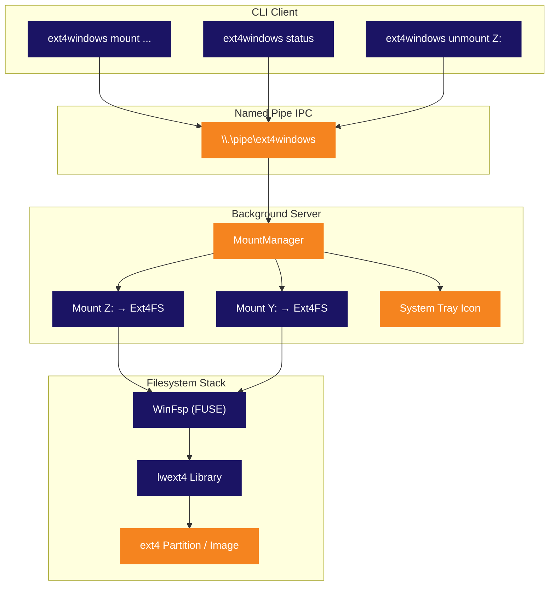

<p align="center">
  
</p>

<p align="center">
  <strong>Monte partições ext4 do Linux como letras de drive nativas do Windows.</strong><br>
  <sub>Sem VM. Sem WSL. Sem complicação. Conecte e navegue.</sub>
</p>

<p align="center">
  
  
  
  
  
  
</p>

<p align="center">
  
  
  
  
</p>

<p align="center">
  <sub>🌍 <a href="../README.md">English</a> · <strong>Português</strong> · <a href="README.es.md">Español</a> · <a href="README.de.md">Deutsch</a> · <a href="README.fr.md">Français</a> · <a href="README.zh.md">中文</a> · <a href="README.ja.md">日本語</a> · <a href="README.ru.md">Русский</a></sub>
</p>

<p align="center">
  <a href="#início-rápido"><kbd> <br> Início Rápido <br> </kbd></a>&nbsp;&nbsp;
  <a href="#instalação"><kbd> <br> Instalação <br> </kbd></a>&nbsp;&nbsp;
  <a href="#compilar-do-código-fonte"><kbd> <br> Compilar do Código-Fonte <br> </kbd></a>&nbsp;&nbsp;
  <a href="https://github.com/Mateuscruz19/Ext4Windows/issues"><kbd> <br> Reportar Bug <br> </kbd></a>
</p>

<br>

<p align="center">
  
</p>

<br>

## O Problema

Dual-boot com Linux e Windows é comum. Acessar seus arquivos do Linux a partir do Windows? **Doloroso.**

O Windows tem **zero** suporte nativo a ext4. Sua partição Linux fica invisível. Seus arquivos estão presos atrás de um sistema de arquivos que o Windows se recusa a ler.

As soluções existentes têm sérias desvantagens:

| Ferramenta | Problema |
|:-----------|:---------|
| **Ext2Fsd** | Abandonado desde 2017. Driver em kernel-mode = risco de BSOD. Sem suporte a ext4 extents. |
| **Paragon ExtFS** | Software pago ($40+). Código fechado. |
| **DiskInternals Reader** | Somente leitura. Sem drive letter — arquivos acessados por uma interface própria desajeitada. |
| **WSL `wsl --mount`** | Roda dentro de uma VM Hyper-V. Requer admin. Não é uma drive letter real. Arquivos acessados pelo caminho `\\wsl$\`. |

<br>

## A Solução

O **Ext4Windows** monta sistemas de arquivos ext4 como **drive letters reais do Windows**. Seus arquivos do Linux aparecem no Explorer, como qualquer pendrive USB. Abrir, editar, copiar, deletar — tudo funciona nativamente.

```
C:\> ext4windows mount D:\linux.img
  OK Mounted D:\linux.img on Z: (read-only)
```

Seus arquivos ext4 agora estão em **Z:** — navegue pelo Explorer, abra em qualquer programa, arraste e solte. Pronto.

<br>

<p align="center">
  
</p>

<br>

## Funcionalidades

<table>
<tr>
<td width="50%" valign="top">

### Principal
- Montar imagens ext4 (`.img`) como drive letters
- Montar partições ext4 raw de discos físicos
- Suporte completo de **leitura** — arquivos, diretórios, symlinks
- Suporte completo de **escrita** — criar, editar, deletar, copiar, renomear
- Múltiplas montagens simultâneas (Z:, Y:, X:, ...)

</td>
<td width="50%" valign="top">

### Arquitetura
- Servidor em segundo plano com **ícone na bandeja do sistema**
- Cliente CLI para scripts e automação
- Named Pipe IPC para comunicação rápida cliente-servidor
- Inicialização automática do servidor no primeiro comando de mount
- Limpeza automática ao ejetar/unmount

</td>
</tr>
<tr>
<td width="50%" valign="top">

### Usabilidade
- **Detecção automática** de partições ext4 com `scan`
- Seleção automática de drive letter livre (Z: descendo até D:)
- Clique com botão direito no ícone da bandeja para unmount ou sair
- Modo legado one-shot para uso simples
- Logging de debug para solução de problemas

</td>
<td width="50%" valign="top">

### Técnico
- Driver em userspace — sem módulo kernel, sem risco de BSOD
- Nomes de dispositivo ext4 por instância (seguro para multi-mount)
- Mutex global para thread safety do lwext4
- Padrão open-per-operation (sem vazamento de handles)
- Detecção de ghost mount e limpeza automática

</td>
</tr>
</table>

<br>

<p align="center">
  
</p>

<br>

## Comparação

Como o Ext4Windows se compara às alternativas?

| Funcionalidade | Ext4Windows | Ext2Fsd | DiskInternals | Paragon | WSL `--mount` |
|:---------------|:-----------:|:-------:|:-------------:|:-------:|:-------------:|
| **Drive letter real** | ✅ | ✅ | ❌ | ✅ | ❌ |
| **Suporte a leitura** | ✅ | ✅ | ✅ | ✅ | ✅ |
| **Suporte a escrita** | ✅ | ⚠️ Parcial | ❌ | ✅ | ✅ |
| **ext4 extents** | ✅ | ❌ | ✅ | ✅ | ✅ |
| **Sem reinicialização** | ✅ | ❌ | ✅ | ✅ | ✅ |
| **Sem admin necessário** | ✅ | ❌ | ✅ | ❌ | ❌ |
| **Interface na bandeja** | ✅ | ❌ | ✅ | ✅ | ❌ |
| **Código aberto** | ✅ | ✅ | ❌ | ❌ | ❌ |
| **Mantido ativamente** | ✅ | ❌ (2017) | ❌ | ✅ | ✅ |
| **Userspace (sem BSOD)** | ✅ | ❌ | ✅ | ❌ | ✅ |
| **Gratuito** | ✅ | ✅ | ✅ | ❌ ($40+) | ✅ |

<br>

<p align="center">
  
</p>

<br>

## Início Rápido

### Montar uma imagem ext4

```bash
# Montar somente leitura (padrão) — seleciona drive letter automaticamente
ext4windows mount path\to\image.img

# Montar em uma drive letter específica
ext4windows mount path\to\image.img X:

# Montar com suporte a escrita
ext4windows mount path\to\image.img --rw

# Montar com escrita em uma letra específica
ext4windows mount path\to\image.img X: --rw
```

### Gerenciar montagens

```bash
# Verificar o que está montado
ext4windows status

# Desmontar um drive
ext4windows unmount Z:

# Buscar partições ext4 em discos físicos (requer admin)
ext4windows scan

# Encerrar o servidor em segundo plano
ext4windows quit
```

### Modo legado

Para uso rápido sem a arquitetura cliente-servidor:

```bash
# Montar e bloquear até Ctrl+C
ext4windows path\to\image.img Z:

# Montar com escrita no modo legado
ext4windows path\to\image.img Z: --rw
```

<br>

<p align="center">
  
</p>

<br>

## Arquitetura

O Ext4Windows usa uma **arquitetura cliente-servidor**. O primeiro comando `mount` inicia automaticamente um servidor em segundo plano, que gerencia todas as montagens e exibe um ícone na bandeja do sistema.



### Como funciona a leitura de um arquivo

Quando você abre um arquivo no Explorer no drive montado, é isso que acontece por baixo dos panos:

```
Explorer abre Z:\docs\readme.txt
  → Kernel do Windows envia IRP_MJ_READ para o driver WinFsp
    → WinFsp chama nosso callback OnRead no Ext4FileSystem
      → Travamos o mutex global do ext4
        → lwext4 abre o arquivo: ext4_fopen("/mnt_Z/docs/readme.txt", "rb")
        → lwext4 lê os bytes solicitados: ext4_fread()
        → lwext4 fecha o arquivo: ext4_fclose()
      → Destravamos o mutex
    → Dados retornam pelo WinFsp até o kernel
  → Explorer exibe o conteúdo do arquivo
```

### Bandeja do Sistema

O servidor cria um **ícone na bandeja do sistema** (área de notificação) usando a API Win32 pura:

- **Passe o mouse** sobre o ícone para ver a quantidade de montagens
- **Clique com o botão direito** para ver montagens ativas, desmontar drives ou sair
- O ícone usa o logo do Ext4Windows (embutido no exe via arquivo de recursos)
- Se um drive for ejetado pelo Explorer, o servidor detecta e limpa automaticamente o ghost mount

<br>

<p align="center">
  
</p>

<br>

## Instalação

### Pré-requisitos

- **Windows 10 ou 11** (64-bit)
- **[WinFsp](https://winfsp.dev/rel/)** — baixe e instale a versão mais recente

### Download

> Releases em breve. Por enquanto, [compile do código-fonte](#-compilar-do-código-fonte).

### Verificar se funciona

```bash
# Criar uma imagem ext4 de teste usando WSL (se disponível)
wsl -e bash -c "dd if=/dev/zero of=/tmp/test.img bs=1M count=64 && mkfs.ext4 /tmp/test.img"
cp \\wsl$\Ubuntu\tmp\test.img .

# Montar
ext4windows mount test.img
```

<br>

<p align="center">
  
</p>

<br>

## Compilar do Código-Fonte

### Pré-requisitos

| Ferramenta | Versão | Finalidade |
|:-----------|:-------|:-----------|
| **Windows** | 10 ou 11 | Sistema operacional alvo |
| **Visual Studio 2022** | Build Tools ou IDE completa | Compilador C++ (MSVC) |
| **CMake** | 3.16+ | Sistema de build |
| **Git** | Qualquer | Clonar com submódulos |
| **[WinFsp](https://winfsp.dev/rel/)** | Mais recente | Framework FUSE + SDK |

> **Nota:** Você precisa da workload **"Desenvolvimento para desktop com C++"** no Visual Studio.

### Clonar

```bash
git clone --recursive https://github.com/Mateuscruz19/Ext4Windows.git
cd Ext4Windows
```

> A flag `--recursive` é importante — ela puxa o submódulo **lwext4** de `external/lwext4/`.

### Compilar

Abra um **Developer Command Prompt for VS 2022** (ou execute `VsDevCmd.bat`), depois:

```bash
mkdir build
cd build
cmake ..
cmake --build .
```

O executável estará em `build\ext4windows.exe`.

### Script de build rápido

Se você tem o VS Build Tools instalado, basta executar:

```bash
build.bat
```

Este script configura automaticamente o ambiente do VS e compila.

### Estrutura do projeto

```
Ext4Windows/
├── assets/                    # Logo e recursos visuais
│   ├── ext4windows.ico        # Ícone do aplicativo (multi-tamanho)
│   ├── logo_icon.png          # Logo sem texto
│   └── logo_with_text.png     # Logo com texto "Ext4Windows"
├── cmake/                     # Módulos CMake (FindWinFsp)
├── external/
│   └── lwext4/                # Submódulo lwext4 (implementação ext4)
├── src/
│   ├── main.cpp               # Ponto de entrada e roteamento de argumentos
│   ├── ext4_filesystem.cpp/hpp  # Callbacks do sistema de arquivos WinFsp
│   ├── server.cpp/hpp         # Servidor em segundo plano + MountManager
│   ├── client.cpp/hpp         # Cliente CLI
│   ├── tray_icon.cpp/hpp      # Ícone na bandeja do sistema (Win32)
│   ├── pipe_protocol.hpp      # Protocolo Named Pipe IPC
│   ├── blockdev_file.cpp/hpp  # Block device a partir de arquivo .img
│   ├── blockdev_partition.cpp/hpp  # Block device a partir de partição raw
│   ├── partition_scanner.cpp/hpp   # Detecção automática de partições ext4
│   ├── debug_log.hpp          # Utilitários de logging de debug
│   └── ext4windows.rc         # Arquivo de recursos do Windows (ícone)
├── CMakeLists.txt             # Configuração de build
├── build.bat                  # Script de build rápido
└── LICENSE                    # GPL-2.0
```

<br>

<p align="center">
  
</p>

<br>

## Stack Tecnológica

<table>
<tr>
<td align="center" width="150">
  
  <br><sub>Linguagem principal</sub>
</td>
<td align="center" width="150">
  
  <br><sub>Sistema de arquivos virtual</sub>
</td>
<td align="center" width="150">
  
  <br><sub>Implementação ext4</sub>
</td>
<td align="center" width="150">
  
  <br><sub>Bandeja, pipes, processos</sub>
</td>
<td align="center" width="150">
  
  <br><sub>Sistema de build</sub>
</td>
</tr>
</table>

| Biblioteca | Função | Link |
|:-----------|:-------|:-----|
| **WinFsp** | Framework FUSE para Windows. Cria sistemas de arquivos virtuais que aparecem como drives reais. Cuida de toda a comunicação com o kernel — nós apenas implementamos callbacks (OnRead, OnWrite, OnCreate, etc.) | [winfsp.dev](https://winfsp.dev) |
| **lwext4** | Biblioteca portátil de sistema de arquivos ext4 em C puro. Lê e escreve o formato ext4 em disco: superblock, block groups, inodes, extents, entradas de diretório. Usamos como submódulo. | [github.com/gkostka/lwext4](https://github.com/gkostka/lwext4) |
| **Win32 API** | APIs nativas do Windows para ícone na bandeja do sistema (`Shell_NotifyIconW`), named pipes (`CreateNamedPipeW`), gerenciamento de processos (`CreateProcessW`) e detecção de drive letters (`GetLogicalDrives`). | [learn.microsoft.com](https://learn.microsoft.com/en-us/windows/win32/) |

<br>

<p align="center">
  
</p>

<br>

## Segurança e Integridade de Memória

O Ext4Windows é auditado com quatro ferramentas de análise independentes. Todos os testes são executados a cada release.

<table>
<tr>
<th>Ferramenta</th>
<th>O que verifica</th>
<th>Resultado</th>
</tr>
<tr>
<td><strong>AddressSanitizer (ASan)</strong><br><sub><code>/fsanitize=address</code></sub></td>
<td>Buffer overflows, use-after-free, corrupção de stack, corrupção de heap — detectados em tempo de execução durante um ciclo completo de mount → read → write → unmount → quit</td>
<td><strong>PASS — 0 erros</strong></td>
</tr>
<tr>
<td><strong>MSVC Code Analysis</strong><br><sub><code>/analyze</code></sub></td>
<td>Análise estática para desreferência de ponteiro nulo, buffer overruns, memória não inicializada, integer overflows, anti-padrões de segurança (regras C6000–C28000)</td>
<td><strong>PASS — 0 vulnerabilidades</strong><br><sub>7 avisos informativos (verificações de handle nulo — todos protegidos em tempo de execução)</sub></td>
</tr>
<tr>
<td><strong>CppCheck 2.20</strong><br><sub><code>--enable=all --inconclusive</code></sub></td>
<td>Analisador estático independente (183 verificadores): buffer overflows, desreferências nulas, vazamentos de recursos, variáveis não inicializadas, problemas de portabilidade</td>
<td><strong>PASS — 0 bugs, 0 vulnerabilidades</strong><br><sub>Apenas sugestões de estilo (const correctness, variáveis não utilizadas)</sub></td>
</tr>
<tr>
<td><strong>CRT Debug Heap</strong><br><sub><code>_CrtDumpMemoryLeaks</code></sub></td>
<td>Vazamentos de memória — rastreia cada <code>new</code>/<code>malloc</code> e reporta qualquer coisa não liberada ao sair. Testado: criação/destruição de blockdev, ciclo completo de mount/read/unmount ext4</td>
<td><strong>PASS — 0 vazamentos</strong></td>
</tr>
</table>

### Medidas de segurança

| Proteção | Descrição |
|:---------|:----------|
| **ACL do Named Pipe** | Pipe restrito ao usuário criador via SDDL `D:(A;;GA;;;CU)` — outros usuários do sistema não podem enviar comandos |
| **Prevenção de path traversal** | Todos os caminhos são validados contra sequências `..` e bytes nulos antes do processamento |
| **Validação de drive letter** | Apenas `A-Z` aceitos como drive letters nos comandos MOUNT/MOUNT_PARTITION |
| **Proteção contra integer overflow** | Tamanhos de leitura/escrita de blocos verificados antes da multiplicação para prevenir overflow de DWORD |
| **Caminho explícito do processo** | `CreateProcessW` usa caminho explícito do exe (sem hijacking de busca no PATH) |
| **Cópias de string limitadas** | Todos os `wcscpy` substituídos por `wcsncpy` + terminador nulo para prevenir buffer overflow |
| **Driver em userspace** | Sem módulo kernel — um crash não pode causar BSOD ou corromper a memória do sistema |

<br>

<p align="center">
  
</p>

<br>

## Roadmap

### Concluído

- [x] Montar imagens ext4 como drive letters do Windows
- [x] Suporte completo de leitura — arquivos, diretórios, symlinks
- [x] Suporte completo de escrita — criar, editar, deletar, copiar, renomear
- [x] Detecção automática de partições ext4 em discos físicos
- [x] Arquitetura cliente-servidor com daemon em segundo plano
- [x] Ícone na bandeja do sistema com menu de contexto
- [x] Múltiplas montagens simultâneas
- [x] Protocolo Named Pipe IPC
- [x] Inicialização automática do servidor no primeiro mount
- [x] Detecção de ghost mount (limpeza automática ao ejetar)
- [x] Logging de debug (console + arquivo)
- [x] Ícone personalizado do aplicativo

### Em Andamento

(nada no momento)

### Concluídos Recentemente

- [x] Montar partições raw via cliente-servidor (comandos MOUNT_PARTITION + SCAN)
- [x] Mapeamento de permissões Linux (ext4 mode bits → atributos e ACLs do Windows)
- [x] Inicialização automática no login (chave Run do Registro do Windows)
- [x] Timestamps de arquivos (ext4 crtime/atime/mtime/ctime → Windows creation/access/write/change)
- [x] Suporte a journaling (ext4_recover + ext4_journal_start/stop)
- [x] Otimização de performance (cache de blocos de 512KB + cache de metadados do WinFsp)
- [x] Suporte a arquivos grandes (>4GB com cálculos de bloco de 64 bits)
- [x] Instalador (Inno Setup) e release portátil (.zip)

### Planejado

- [x] Painel de configurações (baseado em terminal, persistido em arquivo de configuração)

<br>

<p align="center">
  
</p>

<br>

<details>
<summary><h2>Perguntas Frequentes</h2></summary>

### Isso é seguro? Pode corromper minha partição Linux?

O Ext4Windows roda inteiramente em **userspace** (graças ao WinFsp), então não pode causar uma Tela Azul da Morte (BSOD). O código é auditado com AddressSanitizer, análise estática do MSVC e detecção de vazamentos CRT — veja [Segurança e Integridade de Memória](#segurança-e-integridade-de-memória). Por segurança, o modo padrão de montagem é **somente leitura**. O modo de escrita (`--rw`) inclui suporte a journaling ext4 para recuperação de falhas. Sempre mantenha backups.

### Preciso de privilégios de administrador?

**Não** — para montar imagens (`.img`), não é necessário admin. O comando `scan` (que busca em discos físicos) requer admin porque precisa acessar dispositivos de disco raw (`\\.\PhysicalDrive0`, etc.). O programa solicita automaticamente elevação UAC quando necessário.

### Quais funcionalidades ext4 são suportadas?

O lwext4 suporta as funcionalidades principais do ext4: extents, endereçamento de blocos de 64 bits, indexação de diretórios (htree), checksums de metadados e journaling (recuperação + transações de escrita). Funcionalidades **não** suportadas: inline data, encryption e verity.

### Posso montar partições ext2 ou ext3?

Sim! O ext4 é retrocompatível com ext2 e ext3. O lwext4 consegue ler os três formatos.

### Funciona com partições Linux de dual-boot?

Sim, esse é o caso de uso principal. Use `ext4windows scan` para encontrar e montar sua partição Linux. **Importante:** não monte sua partição root do Linux com `--rw` enquanto o Linux pode estar usando ela (por exemplo, se você estiver rodando WSL). Isso pode causar corrupção de dados.

### Por que não usar simplesmente o WSL `wsl --mount`?

O WSL monta partições dentro de uma máquina virtual Hyper-V. Os arquivos são acessíveis apenas pelo caminho de rede `\\wsl$\`, não como uma drive letter real. Requer admin, tem overhead maior e não se integra com o Windows Explorer da mesma forma que um drive real.

### Posso usar com pendrives USB formatados como ext4?

Sim! Use `ext4windows scan` para detectar a partição ext4 no pendrive USB e depois monte.

### O ícone da bandeja desapareceu. O que aconteceu?

O servidor pode ter travado ou sido encerrado. Execute `ext4windows status` — se o servidor não estiver rodando, o próximo comando `mount` vai iniciá-lo automaticamente.

### Como habilitar o logging de debug?

Adicione `--debug` a qualquer comando:

```bash
ext4windows mount image.img --debug
```

Para o servidor, os logs de debug são escritos em `%TEMP%\ext4windows_server.log`.

</details>

<br>

<details>
<summary><h2>Solução de Problemas</h2></summary>

### "Error: could not start server"

O processo do servidor falhou ao iniciar. Possíveis causas:
- Outra instância já está rodando — tente `ext4windows quit` primeiro
- O antivírus está bloqueando o processo — adicione uma exceção para `ext4windows.exe`
- O WinFsp não está instalado — baixe em [winfsp.dev/rel](https://winfsp.dev/rel/)

### "Error: server did not start in time"

O servidor iniciou, mas o named pipe não foi criado dentro de 3 segundos. Isso pode acontecer se:
- A DLL do WinFsp (`winfsp-x64.dll`) não foi encontrada — certifique-se de que está no mesmo diretório que `ext4windows.exe` ou que o WinFsp está instalado globalmente no sistema
- O sistema está sob carga pesada — tente novamente

### "Mount failed (status=0xC00000XX)"

O WinFsp retornou um erro durante o mount. Códigos comuns:
- `0xC0000034` — Drive letter já em uso por outro programa
- `0xC0000022` — Permissão negada (tente executar como admin)
- `0xC000000F` — Arquivo não encontrado (verifique o caminho da imagem)

### "Error: server is busy, try again"

O servidor processa um comando por vez. Se outro cliente está se comunicando no momento, você receberá este erro. Basta tentar novamente.

### Arquivos mostram 0 bytes ou não podem ser abertos

Isso geralmente significa que a imagem ext4 está corrompida ou usa funcionalidades não suportadas. Tente:
1. Verificar a imagem com `fsck.ext4` no Linux/WSL
2. Habilitar o logging de debug (`--debug`) para ver o erro específico
3. Tente montar somente leitura primeiro (remova `--rw`)

### Drive desapareceu do Explorer

Se você ejetar o drive pelo Explorer (clique direito → Ejetar), o servidor detecta isso e limpa automaticamente. Execute `ext4windows status` para confirmar. Para remontar, execute o comando de mount novamente.

</details>

<br>

<p align="center">
  
</p>

<br>

## Contribuindo

Contribuições são bem-vindas! Este projeto está em desenvolvimento ativo e há muito o que fazer.

1. **Faça um fork** do repositório
2. **Crie** uma branch de feature (`git checkout -b feature/coisa-incrivel`)
3. **Faça commit** das suas alterações
4. **Faça push** para a branch
5. **Abra** um Pull Request

Confira o [Roadmap](#roadmap) para ideias do que trabalhar. Sinta-se à vontade para abrir uma issue para discussão antes de começar mudanças grandes.

<br>

## Licença

Este projeto é licenciado sob a **GNU General Public License v2.0** — veja o arquivo [LICENSE](LICENSE) para detalhes.

<br>

<p align="center">
  
</p>

<p align="center">
  <sub>Construído com WinFsp e lwext4. Logo inspirado na pegada do pinguim do Linux e na janela do Windows.</sub>
</p>
