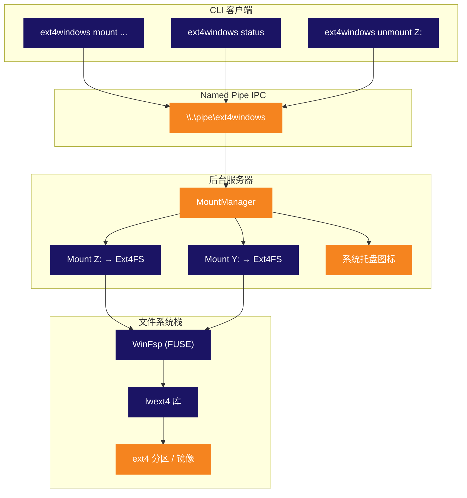

<p align="center">
  
</p>

<p align="center">
  <strong>将 Linux ext4 分区挂载为 Windows 原生驱动器盘符。</strong><br>
  <sub>无需虚拟机。无需 WSL。无需折腾。即插即用。</sub>
</p>

<p align="center">
  
  
  
  
  
  
</p>

<p align="center">
  
  
  
  
</p>

<p align="center">
  <sub>🌍 <a href="../README.md">English</a> · <a href="README.pt-BR.md">Português</a> · <a href="README.es.md">Español</a> · <a href="README.de.md">Deutsch</a> · <a href="README.fr.md">Français</a> · <b>中文</b> · <a href="README.ja.md">日本語</a> · <a href="README.ru.md">Русский</a></sub>
</p>

<p align="center">
  <a href="#快速开始"><kbd> <br> 快速开始 <br> </kbd></a>&nbsp;&nbsp;
  <a href="#安装"><kbd> <br> 安装 <br> </kbd></a>&nbsp;&nbsp;
  <a href="#从源码构建"><kbd> <br> 从源码构建 <br> </kbd></a>&nbsp;&nbsp;
  <a href="https://github.com/Mateuscruz19/Ext4Windows/issues"><kbd> <br> 报告问题 <br> </kbd></a>
</p>

<br>

<p align="center">
  
</p>

<br>

## 问题所在

双启动 Linux 和 Windows 很常见。但从 Windows 访问 Linux 文件？**非常痛苦。**

Windows 对 ext4 的原生支持为**零**。你的 Linux 分区完全不可见。你的文件被困在 Windows 拒绝读取的文件系统之后。

现有的解决方案都有严重的缺陷：

| 工具 | 问题 |
|:-----|:--------|
| **Ext2Fsd** | 自 2017 年起已停止维护。内核模式驱动 = 有 BSOD 风险。不支持 ext4 extent。 |
| **Paragon ExtFS** | 付费软件（$40+）。闭源。 |
| **DiskInternals Reader** | 只读。没有驱动器盘符 — 需要通过笨重的自定义界面访问文件。 |
| **WSL `wsl --mount`** | 运行在 Hyper-V 虚拟机内部。需要管理员权限。不是真正的驱动器盘符。文件通过 `\\wsl$\` 路径访问。 |

<br>

## 解决方案

**Ext4Windows** 将 ext4 文件系统挂载为**真正的 Windows 驱动器盘符**。你的 Linux 文件会像普通 USB 驱动器一样显示在资源管理器中。打开、编辑、复制、删除 — 一切都原生运作。

```
C:\> ext4windows mount D:\linux.img
  OK Mounted D:\linux.img on Z: (read-only)
```

你的 ext4 文件现在在 **Z:** 盘上 — 在资源管理器中浏览、用任意应用打开、拖放操作。搞定。

<br>

<p align="center">
  
</p>

<br>

## 功能特性

<table>
<tr>
<td width="50%" valign="top">

### 核心功能
- 将 ext4 镜像文件（`.img`）挂载为驱动器盘符
- 挂载物理磁盘上的原始 ext4 分区
- 完整的**读取支持** — 文件、目录、符号链接
- 完整的**写入支持** — 创建、编辑、删除、复制、重命名
- 多个同时挂载（Z:、Y:、X:、...）

</td>
<td width="50%" valign="top">

### 架构
- 带有**系统托盘图标**的后台服务器
- 用于脚本和自动化的 CLI 客户端
- Named Pipe IPC 实现快速客户端-服务器通信
- 首次 mount 命令时自动启动服务器
- 弹出/unmount 时优雅清理

</td>
</tr>
<tr>
<td width="50%" valign="top">

### 易用性
- 使用 `scan` **自动检测** ext4 分区
- 自动选择空闲驱动器盘符（从 Z: 到 D: 依次递减）
- 右键点击托盘图标可 unmount 或退出
- 传统单次模式，适合简单使用
- 调试日志用于问题排查

</td>
<td width="50%" valign="top">

### 技术细节
- 用户态驱动 — 无内核模块，无 BSOD 风险
- 每实例独立的 ext4 设备名（多挂载安全）
- 全局 mutex 保障 lwext4 线程安全
- 按操作打开模式（无句柄泄漏）
- 幽灵挂载检测与自动清理

</td>
</tr>
</table>

<br>

<p align="center">
  
</p>

<br>

## 对比

Ext4Windows 与其他替代方案的对比如何？

| 功能 | Ext4Windows | Ext2Fsd | DiskInternals | Paragon | WSL `--mount` |
|:--------|:-----------:|:-------:|:-------------:|:-------:|:-------------:|
| **真正的驱动器盘符** | ✅ | ✅ | ❌ | ✅ | ❌ |
| **读取支持** | ✅ | ✅ | ✅ | ✅ | ✅ |
| **写入支持** | ✅ | ⚠️ 部分支持 | ❌ | ✅ | ✅ |
| **ext4 extent** | ✅ | ❌ | ✅ | ✅ | ✅ |
| **无需重启** | ✅ | ❌ | ✅ | ✅ | ✅ |
| **无需管理员权限** | ✅ | ❌ | ✅ | ❌ | ❌ |
| **系统托盘 GUI** | ✅ | ❌ | ✅ | ✅ | ❌ |
| **开源** | ✅ | ✅ | ❌ | ❌ | ❌ |
| **积极维护** | ✅ | ❌ (2017) | ❌ | ✅ | ✅ |
| **用户态（无 BSOD）** | ✅ | ❌ | ✅ | ❌ | ✅ |
| **免费** | ✅ | ✅ | ✅ | ❌ ($40+) | ✅ |

<br>

<p align="center">
  
</p>

<br>

## 快速开始

### 挂载 ext4 镜像

```bash
# 以只读方式挂载（默认） — 自动选择驱动器盘符
ext4windows mount path\to\image.img

# 挂载到指定驱动器盘符
ext4windows mount path\to\image.img X:

# 以读写方式挂载
ext4windows mount path\to\image.img --rw

# 以读写方式挂载到指定盘符
ext4windows mount path\to\image.img X: --rw
```

### 管理挂载

```bash
# 查看当前挂载状态
ext4windows status

# 卸载驱动器
ext4windows unmount Z:

# 扫描物理磁盘上的 ext4 分区（需要管理员权限）
ext4windows scan

# 关闭后台服务器
ext4windows quit
```

### 传统模式

用于无需客户端-服务器架构的快速一次性使用：

```bash
# 挂载并阻塞直到 Ctrl+C
ext4windows path\to\image.img Z:

# 以传统模式读写挂载
ext4windows path\to\image.img Z: --rw
```

<br>

<p align="center">
  
</p>

<br>

## 架构

Ext4Windows 采用**客户端-服务器架构**。第一个 `mount` 命令会自动启动后台服务器，该服务器管理所有挂载并显示系统托盘图标。



### 文件读取的工作原理

当你在挂载的驱动器上通过资源管理器打开一个文件时，底层发生的事情如下：

```
资源管理器打开 Z:\docs\readme.txt
  → Windows 内核发送 IRP_MJ_READ 到 WinFsp 驱动
    → WinFsp 调用我们 Ext4FileSystem 中的 OnRead 回调
      → 我们锁定全局 ext4 mutex
        → lwext4 打开文件：ext4_fopen("/mnt_Z/docs/readme.txt", "rb")
        → lwext4 读取请求的字节：ext4_fread()
        → lwext4 关闭文件：ext4_fclose()
      → 我们解锁 mutex
    → 数据通过 WinFsp 回流到内核
  → 资源管理器显示文件内容
```

### 系统托盘

服务器使用纯 Win32 API 创建**系统托盘图标**（通知区域）：

- **悬停**图标可查看挂载数量
- **右键点击**可查看活动挂载、unmount 驱动器或退出
- 图标使用 Ext4Windows logo（通过资源文件嵌入到 exe 中）
- 如果通过资源管理器弹出驱动器，服务器会检测到并自动清理幽灵挂载

<br>

<p align="center">
  
</p>

<br>

## 安装

### 前置条件

- **Windows 10 或 11**（64 位）
- **[WinFsp](https://winfsp.dev/rel/)** — 下载并安装最新版本

### 下载

> 发布版即将推出。目前请[从源码构建](#从源码构建)。

### 验证是否正常工作

```bash
# 使用 WSL 创建测试用 ext4 镜像（如果可用）
wsl -e bash -c "dd if=/dev/zero of=/tmp/test.img bs=1M count=64 && mkfs.ext4 /tmp/test.img"
cp \\wsl$\Ubuntu\tmp\test.img .

# 挂载它
ext4windows mount test.img
```

<br>

<p align="center">
  
</p>

<br>

## 从源码构建

### 前置条件

| 工具 | 版本 | 用途 |
|:-----|:--------|:--------|
| **Windows** | 10 或 11 | 目标操作系统 |
| **Visual Studio 2022** | Build Tools 或完整 IDE | C++ 编译器 (MSVC) |
| **CMake** | 3.16+ | 构建系统 |
| **Git** | 任意版本 | 克隆含子模块的仓库 |
| **[WinFsp](https://winfsp.dev/rel/)** | 最新版 | FUSE 框架 + SDK |

> **注意：** 你需要在 Visual Studio 中安装**"使用 C++ 的桌面开发"**工作负载。

### 克隆

```bash
git clone --recursive https://github.com/Mateuscruz19/Ext4Windows.git
cd Ext4Windows
```

> `--recursive` 标志很重要 — 它会拉取 `external/lwext4/` 中的 **lwext4** 子模块。

### 构建

打开 **Developer Command Prompt for VS 2022**（或运行 `VsDevCmd.bat`），然后：

```bash
mkdir build
cd build
cmake ..
cmake --build .
```

可执行文件将位于 `build\ext4windows.exe`。

### 快速构建脚本

如果你已安装 VS Build Tools，直接运行：

```bash
build.bat
```

此脚本会自动设置 VS 环境并进行构建。

### 项目结构

```
Ext4Windows/
├── assets/                    # Logo 和视觉资源
│   ├── ext4windows.ico        # 应用图标（多尺寸）
│   ├── logo_icon.png          # 无文字 Logo
│   └── logo_with_text.png     # 带 "Ext4Windows" 文字的 Logo
├── cmake/                     # CMake 模块 (FindWinFsp)
├── external/
│   └── lwext4/                # lwext4 子模块（ext4 实现）
├── src/
│   ├── main.cpp               # 入口点和参数路由
│   ├── ext4_filesystem.cpp/hpp  # WinFsp 文件系统回调
│   ├── server.cpp/hpp         # 后台服务器 + MountManager
│   ├── client.cpp/hpp         # CLI 客户端
│   ├── tray_icon.cpp/hpp      # 系统托盘图标 (Win32)
│   ├── pipe_protocol.hpp      # Named Pipe IPC 协议
│   ├── blockdev_file.cpp/hpp  # 从 .img 文件创建块设备
│   ├── blockdev_partition.cpp/hpp  # 从原始分区创建块设备
│   ├── partition_scanner.cpp/hpp   # ext4 分区自动检测
│   ├── debug_log.hpp          # 调试日志工具
│   └── ext4windows.rc         # Windows 资源文件（图标）
├── CMakeLists.txt             # 构建配置
├── build.bat                  # 快速构建脚本
└── LICENSE                    # GPL-2.0
```

<br>

<p align="center">
  
</p>

<br>

## 技术栈

<table>
<tr>
<td align="center" width="150">
  
  <br><sub>核心语言</sub>
</td>
<td align="center" width="150">
  
  <br><sub>虚拟文件系统</sub>
</td>
<td align="center" width="150">
  
  <br><sub>ext4 实现</sub>
</td>
<td align="center" width="150">
  
  <br><sub>托盘、管道、进程</sub>
</td>
<td align="center" width="150">
  
  <br><sub>构建系统</sub>
</td>
</tr>
</table>

| 库 | 作用 | 链接 |
|:--------|:-----|:-----|
| **WinFsp** | Windows FUSE 框架。创建显示为真实驱动器的虚拟文件系统。处理所有内核通信 — 我们只需实现回调（OnRead、OnWrite、OnCreate 等） | [winfsp.dev](https://winfsp.dev) |
| **lwext4** | 纯 C 编写的可移植 ext4 文件系统库。读写 ext4 磁盘格式：超级块、块组、inode、extent、目录项。我们将其作为子模块使用。 | [github.com/gkostka/lwext4](https://github.com/gkostka/lwext4) |
| **Win32 API** | 原生 Windows API，用于系统托盘图标（`Shell_NotifyIconW`）、Named Pipe（`CreateNamedPipeW`）、进程管理（`CreateProcessW`）和驱动器盘符检测（`GetLogicalDrives`）。 | [learn.microsoft.com](https://learn.microsoft.com/en-us/windows/win32/) |

<br>

<p align="center">
  
</p>

<br>

## 安全性与内存安全

Ext4Windows 使用四种独立的分析工具进行审计。所有测试在每次发布时都会运行。

<table>
<tr>
<th>工具</th>
<th>检查内容</th>
<th>结果</th>
</tr>
<tr>
<td><strong>AddressSanitizer (ASan)</strong><br><sub><code>/fsanitize=address</code></sub></td>
<td>缓冲区溢出、释放后使用、栈损坏、堆损坏 — 在完整的 mount → 读取 → 写入 → unmount → 退出周期中进行运行时检测</td>
<td><strong>通过 — 0 个错误</strong></td>
</tr>
<tr>
<td><strong>MSVC 代码分析</strong><br><sub><code>/analyze</code></sub></td>
<td>静态分析检查空指针解引用、缓冲区溢出、未初始化内存、整数溢出、安全反模式（C6000–C28000 规则）</td>
<td><strong>通过 — 0 个漏洞</strong><br><sub>7 条信息性警告（句柄空检查 — 运行时均已防护）</sub></td>
</tr>
<tr>
<td><strong>CppCheck 2.20</strong><br><sub><code>--enable=all --inconclusive</code></sub></td>
<td>独立静态分析器（183 个检查器）：缓冲区溢出、空指针解引用、资源泄漏、未初始化变量、可移植性问题</td>
<td><strong>通过 — 0 个 bug，0 个漏洞</strong><br><sub>仅有风格建议（const 正确性、未使用变量）</sub></td>
</tr>
<tr>
<td><strong>CRT 调试堆</strong><br><sub><code>_CrtDumpMemoryLeaks</code></sub></td>
<td>内存泄漏 — 跟踪每个 <code>new</code>/<code>malloc</code> 并报告退出时未释放的内容。测试项：blockdev 创建/销毁、完整的 ext4 mount/读取/unmount 周期</td>
<td><strong>通过 — 0 个泄漏</strong></td>
</tr>
</table>

### 安全加固措施

| 防护措施 | 描述 |
|:-----------|:------------|
| **Named Pipe ACL** | 通过 SDDL `D:(A;;GA;;;CU)` 将管道限制为创建者用户 — 系统上的其他用户无法发送命令 |
| **路径遍历防护** | 所有路径在处理前都会验证 `..` 序列和空字节 |
| **驱动器盘符验证** | MOUNT/MOUNT_PARTITION 命令中仅接受 `A-Z` 作为驱动器盘符 |
| **整数溢出防护** | 块读写大小在乘法运算前进行检查，防止 DWORD 溢出 |
| **显式进程路径** | `CreateProcessW` 使用显式 exe 路径（无 PATH 搜索劫持） |
| **有界字符串复制** | 所有 `wcscpy` 替换为 `wcsncpy` + 空终止符，防止缓冲区溢出 |
| **用户态驱动** | 无内核模块 — 崩溃不会导致 BSOD 或损坏系统内存 |

<br>

<p align="center">
  
</p>

<br>

## 路线图

### 已完成

- [x] 将 ext4 镜像文件挂载为 Windows 驱动器盘符
- [x] 完整的读取支持 — 文件、目录、符号链接
- [x] 完整的写入支持 — 创建、编辑、删除、复制、重命名
- [x] 自动检测物理磁盘上的 ext4 分区
- [x] 带后台守护进程的客户端-服务器架构
- [x] 带上下文菜单的系统托盘图标
- [x] 多个同时挂载
- [x] Named Pipe IPC 协议
- [x] 首次 mount 时自动启动服务器
- [x] 幽灵挂载检测（弹出时自动清理）
- [x] 调试日志（控制台 + 文件）
- [x] 自定义应用图标

### 进行中

（目前无）

### 最近完成

- [x] 通过客户端-服务器挂载原始分区（MOUNT_PARTITION + SCAN 命令）
- [x] Linux 权限映射（ext4 mode bits → Windows 属性 & ACL）
- [x] 登录时自动启动（Windows 注册表 Run 键）
- [x] 文件时间戳（ext4 crtime/atime/mtime/ctime → Windows 创建/访问/写入/更改时间）
- [x] 日志支持（ext4_recover + ext4_journal_start/stop）
- [x] 性能优化（512KB 块缓存 + WinFsp 元数据缓存）
- [x] 大文件支持（>4GB，64 位块计算）
- [x] 安装程序（Inno Setup）和便携版（.zip）

### 计划中

- [x] 设置面板（基于终端，持久化到配置文件）

<br>

<p align="center">
  
</p>

<br>

<details>
<summary><h2>常见问题</h2></summary>

### 这安全吗？会损坏我的 Linux 分区吗？

Ext4Windows 完全运行在**用户态**（得益于 WinFsp），因此不会导致蓝屏死机 (BSOD)。代码库经过 AddressSanitizer、MSVC 静态分析和 CRT 泄漏检测的审计 — 参见[安全性与内存安全](#安全性与内存安全)。为安全起见，默认挂载模式为**只读**。写入模式（`--rw`）包含 ext4 日志支持以实现崩溃恢复。请始终保持备份。

### 需要管理员权限吗？

**不需要** — 挂载镜像文件（`.img`）不需要管理员权限。`scan` 命令（扫描物理磁盘）确实需要管理员权限，因为它需要访问原始磁盘设备（`\\.\PhysicalDrive0` 等）。程序会在需要时自动提示 UAC 提权。

### 支持哪些 ext4 功能？

lwext4 支持核心 ext4 功能：extent、64 位块寻址、目录索引（htree）、元数据校验和以及日志（恢复 + 写事务）。**不支持**的功能：inline data、加密和 verity。

### 可以挂载 ext2 或 ext3 分区吗？

可以！ext4 向后兼容 ext2 和 ext3。lwext4 可以读取所有三种格式。

### 可以用于双启动的 Linux 分区吗？

可以，这正是主要用途。使用 `ext4windows scan` 查找并挂载你的 Linux 分区。**重要提示：** 当 Linux 可能正在使用该分区时（例如你正在运行 WSL），请不要以 `--rw` 方式挂载你的 Linux 根分区。这可能导致数据损坏。

### 为什么不直接使用 WSL `wsl --mount`？

WSL 在 Hyper-V 虚拟机内挂载分区。文件只能通过 `\\wsl$\` 网络路径访问，而不是真正的驱动器盘符。它需要管理员权限，开销更大，并且不像真正的驱动器那样与 Windows 资源管理器集成。

### 可以用于格式化为 ext4 的 USB 驱动器吗？

可以！使用 `ext4windows scan` 检测 USB 驱动器上的 ext4 分区，然后挂载它。

### 托盘图标消失了。怎么回事？

服务器可能崩溃或被终止了。运行 `ext4windows status` — 如果服务器没有运行，下一个 `mount` 命令会自动启动它。

### 如何启用调试日志？

在任意命令后添加 `--debug`：

```bash
ext4windows mount image.img --debug
```

对于服务器，调试日志写入 `%TEMP%\ext4windows_server.log`。

</details>

<br>

<details>
<summary><h2>故障排除</h2></summary>

### "Error: could not start server"

服务器进程启动失败。可能的原因：
- 另一个实例已在运行 — 先尝试 `ext4windows quit`
- 杀毒软件阻止了进程 — 为 `ext4windows.exe` 添加例外
- 未安装 WinFsp — 从 [winfsp.dev/rel](https://winfsp.dev/rel/) 下载

### "Error: server did not start in time"

服务器已启动但 Named Pipe 未在 3 秒内创建。可能的原因：
- 未找到 WinFsp DLL（`winfsp-x64.dll`）— 确保它与 `ext4windows.exe` 在同一目录中，或已在系统范围内安装 WinFsp
- 系统负载过重 — 请重试

### "Mount failed (status=0xC00000XX)"

WinFsp 在挂载过程中返回错误。常见错误码：
- `0xC0000034` — 驱动器盘符已被其他程序使用
- `0xC0000022` — 权限被拒绝（尝试以管理员身份运行）
- `0xC000000F` — 未找到文件（检查镜像路径）

### "Error: server is busy, try again"

服务器一次只处理一个命令。如果另一个客户端正在通信，你会收到此错误。请重试。

### 文件显示 0 字节或无法打开

这通常意味着 ext4 镜像已损坏或使用了不支持的功能。请尝试：
1. 在 Linux/WSL 中使用 `fsck.ext4` 检查镜像
2. 启用调试日志（`--debug`）查看具体错误
3. 先尝试以只读方式挂载（去掉 `--rw`）

### 驱动器从资源管理器中消失

如果你从资源管理器弹出驱动器（右键点击 → 弹出），服务器会检测到并自动清理。运行 `ext4windows status` 确认。要重新挂载，请再次运行 mount 命令。

</details>

<br>

<p align="center">
  
</p>

<br>

## 贡献

欢迎贡献！本项目正在积极开发中，有很多工作可以参与。

1. **Fork** 本仓库
2. **创建**功能分支（`git checkout -b feature/amazing-thing`）
3. **提交**你的更改
4. **推送**到该分支
5. **发起** Pull Request

查看[路线图](#路线图)了解可以着手的方向。在开始大型更改之前，欢迎先开一个 issue 进行讨论。

<br>

## 许可证

本项目采用 **GNU 通用公共许可证 v2.0** 授权 — 详见 [LICENSE](LICENSE) 文件。

<br>

<p align="center">
  
</p>

<p align="center">
  <sub>基于 WinFsp 和 lwext4 构建。Logo 灵感来源于 Linux 企鹅脚印和 Windows 窗口。</sub>
</p>
